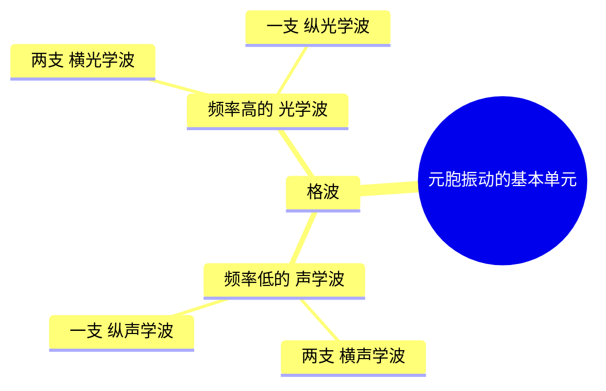
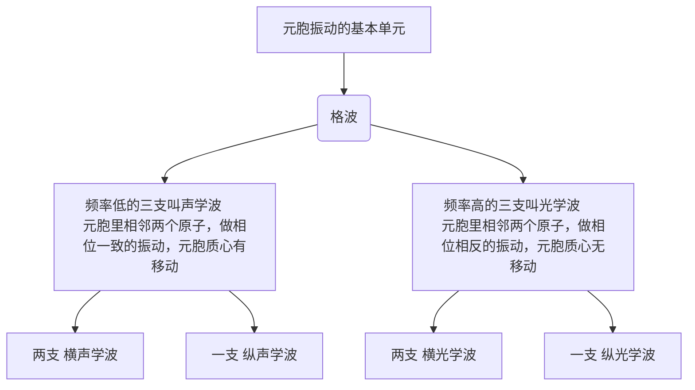

==这个笔记废掉了不看了==
# 考点
## 绪论
1. 中英文定义
## 第一章
1. 画硅锗砷化镓的半导体能带图
2. 紧束缚近似
3. 有效质量的意义，空穴的意义
4. 回旋共振实验
5. 直接带隙半导体，间接
## 第三章
- 用电中性算费米能级，然后再用fei费米能级算载流子的浓度
- 不同温度下的载流子浓度公式
- 简并半导体的几个特性9
# 复习计划
1. 基础知识➕课后题
2. 做群里唯一一张像样的试卷和教改班的试卷
3. 看ppt对应默写英文单词
## 课后题
- [x] 第一章 ✅ 2025-06-11
- [ ] 第二章
- [ ] 第三章
- [ ] 第四章
- [ ] 第五章
## 单词+感念默写
## 听课补充笔记
- [ ] 第一章
- [ ] 第二章
- [ ] 第三章
- [ ] 第四章
- [ ] 第五章
- [ ] 第六章
## 没复习到的
1. 为什么复合率有两种表达方式，分清楚前面p128页的和p131页的
2. 霍尔效应公式
3. 晶向晶面米勒指数j
4. 电子状态的知识，能带啊屏，量子力学那些
5. 类氢模型算电离能公式
6. E-k关系的曲线图怎么在能带图那就变平了？因为能带图之花倒带底和价带顶的
7. 球形等能面和椭圆等能面是怎么回事？
8. 第三第四第五章的课后题全部做完
# 原子的能级和固体的能带

## 1. 原子能级概述
- 原子的电子能级由库仑作用决定，不同电子轨道对应不同能级。
- 电子轨道使用量子数表示，如 $1s, 2p, 3d$ 等。
- 独立原子的能级是离散的，电子只能占据特定能级

## 2. 电子共存化运动与能级分裂
- 当多个原子靠近时，电子的相互作用会导致能级分裂。
- 两个原子相互接近时：
  - 电子云重叠，能级发生轻微劈裂。
  - 随着距离进一步缩小，能级劈裂增大，形成多个分裂能级。
- N 个原子组成晶体时，每个能级会进一步分裂形成 $N$ 个不同能级，构成能带。

## 3. 能带形成
- 由于原子的周期性排列，电子的量子态遍布整个晶体，形成能带结构。
- 对于 $N$ 个原子：
  - 每个原子的电子态可形成 $N$ 个能级，紧密排列形成能带。
  - 能带包含 $3N$ 个共存化状态（$N$ 个原子每个贡献 $3$ 个）。
- 不同能级的电子贡献形成导带、禁带和价带：
  - **价带**：主要由内层电子组成，通常被填满。
  - **导带**：较高能级电子组成，可能为空。
  - **禁带**：无电子占据的能量范围，影响材料的导电性。

## 4. 结论
- 在固体中，电子行为不同于单个原子，能级分裂形成能带。
- 能带理论解释了半导体、导体和绝缘体的基本电学特性：
  - 导体：价带与导带重叠，无禁带。
  - 半导体：禁带较小，电子可被激发至导带。
  - 绝缘体：禁带较大，电子难以跃迁至导带。
# 半导体物理基础概念总结
## 一、基本概念
### （一）能级 (Energy Level)
原子中电子所处的分立能量状态，每个能级有特定能量值，且遵循泡利不相容原理，最多容纳一定数量电子。英文：

### （二）能带
1. **形成**：大量原子组成半导体晶体时，原子相互作用使孤立原子的电子能级分裂，形成一系列能量相近、密集分布的新能级，这些新能级集合构成能带，能级在能带内呈准连续分布 。英文：Energy Band
2. **能带宽度**：由原子间相互作用强度决定，作用越强，能级分裂越显著，能带越宽。

## 二、特殊能带
### （一）价带（Valence Band，VB）
1. **特性**：电子能量较低的能带，绝对零度时被价电子完全填满，电子受原子束缚强，参与形成共价键，常温下对导电贡献小。
2. **与能级关系**：包含多个按能量高低排列的能级，电子按能量最低原理填充其中能级 。

### （二）导带（Conduction Band，CB）
1. **特性**：电子能量较高的能带，绝对零度时纯净半导体导带无电子，温度升高或光照等条件下，价带电子获能跃迁至此，成为可自由移动的载流子，参与导电。
2. **与能级关系**：存在大量可被电子占据的能级，电子跃迁进入后可在这些能级间移动，实现导电。

### （三）禁带（Forbidden Band，FB）
1. **特性**：价带顶和导带底间的能量区域，不存在电子可占据的能级，禁带宽度是半导体重要参数，影响其导电性等特性，禁带越宽，电子跃迁越难，导电性越差。
2. **与能级关系**：禁带隔开了价带和导带的能级，电子跨越需吸收至少等于禁带宽度的能量。

### （四）允带（Allowed Band，AB）
1. **特性**：包含价带和导带等，是晶体中电子可存在的能量区域，允带间被禁带隔开。
2. **与能级关系**：允带内的能级可被电子占据，电子能在允带内能级间跃迁或移动 。

## 三、能级与能带关系总结
1. **能级构成能带**：原子能级因原子相互作用分裂形成能带。
2. **能级分布与特性**：能级在能带内准连续分布，决定能带特性，如电子填充、导电等。
3. **能级跃迁**：电子在不同能带的能级间跃迁，需满足能量条件，跨越禁带时吸收或释放特定能量 。 
# 0 绪论
## 0.1 半导体的定义：

# 1 半导体中的电子状态(Electron states & band structure in semiconductor)
![[Pasted image 20250603090845.png]]
## 1.2 半导体中的电子状态和能带

### 1.2.2 半导体中电子的状态和能带
#### 1.2.2.1半导体中电子的状态
##### 回顾氢原子中电子的电子状态
##### 回顾自由电子的状态
##### 研究半导体中电子的状态

+ 目标：找到半导体中电子的薛定谔方程中势场$V(x)$的形式，然后把它解出来

###### 确定势场的形式：用单电子近似
+ 单电子近似：假设每个电子在周期性排列且固定不动的原子核势场及其他电子的平均势场中运动，该势场是具有与晶格同周期的周期性势场。
###### 找到$V(x)$具体表达式:用克龙尼克·潘纳模型The Clark Panner model
+ 克龙尼克·潘纳模型The Clark Panner model![[Pasted image 20250607113816.png]]

###### 近似地解出套入$V(x)$ 的薛定谔方程:用布洛赫定理
+ 布洛赫定理(Bloch theorem)![[Pasted image 20250607114006.png]]


#### 1.2.2.2 半导体中电子的能带
根据两种极端情况，更好理解图1-10的能带图![[e87c2dc6ed300b9c112101ddb393d5f.jpg]]

### 1.2.3 导体、半导体、绝缘体的能带
#### 导体能带
#### 绝缘体能带
#### 半导体能带
##### 本征激发的概念
## 1.3 半导体中电子的运动——有效质量
### 1.3.2半导体中平均速度
根据量子力学概念，电子的运动可以被视为波包的运动
波包的群速就是电子运动的平均速度。
设波包由许多角频率 $\omega$ 相差不多的波组成
则波包中心的运动速度（即群速）为 $$v = \frac{\mathrm{d}\omega}{\mathrm{d}k} \tag{1-25}$$ 式中，$k$ 为对应的波矢的值。
由波粒二象性，角频率为 $\omega$ 的波，其粒子的能量为 $\hbar\omega$，
代入上式，得到半导体中电子的速度与能量的关系为 $$v = \frac{1}{\hbar}\frac{\mathrm{d}E}{\mathrm{d}k} \tag{1-26}$$ 将式(1-22)代入式(1-26)，得到能带极值附近电子的速度为 $$v = \frac{\hbar k}{m_{\mathrm{n}}^*} \tag{1-27}$$ 式(1-27)与式(1-10)类似，均以电子的有效质量 $m_{\mathrm{n}}^*$ 代换电子的惯性质量 $m_0$。必须注意，能带底 $m_{\mathrm{n}}^* > 0$，在能带底部附近当 $k$ 为正值时，$v$ 也为正值；能带顶 $m_{\mathrm{n}}^* < 0$，在能带顶部附近当 $k$ 为正值时，$v$ 是负值。
![[Pasted image 20250613211804.png]]

### 1.3.3 半导体中电子的加速度

### 1.3.3 半导体中电子的加速度  
实际中，许多半导体器件都在一定的外加电压下工作，半导体内部会产生外加电场，这时电子除受到周期性势场的作用外，还要受到外加电场的作用。在这种情况下，半导体中电子运动的规律又是怎样的呢？下面讨论这个问题。  

当有强度为 $\mathscr{E}$ 的外电场时，电子受到 $f = -q\mathscr{E}$ 的力，$\mathrm{d}t$ 时间内电子有一段位移 $\mathrm{d}s$，外力对电子做的功等于能量的变化，即  
$$\mathrm{d}E = f\mathrm{d}s = fv\mathrm{d}t \tag{1-28}$$  

将式(1-26)代入式(1-28)，得  
$$\mathrm{d}E = \frac{f}{\hbar}\frac{\mathrm{d}E}{\mathrm{d}k}\mathrm{d}t \tag{1-29}$$  

而  
$$\mathrm{d}E = \frac{\mathrm{d}E}{\mathrm{d}k}\mathrm{d}k \tag{1-30}$$  

代入式(1-29)，得  
$$f = \hbar\frac{\mathrm{d}k}{\mathrm{d}t} \tag{1-31}$$  

式(1-31)说明，在外力 $f$ 的作用下，电子的波矢 $k$ 的值不断改变，其变化率与外力成正比。  

因为电子的速度与 $k$ 有关，既然 $k$ 状态不断变化，电子的速度就必然不断变化，其加速度为  
$$a = \frac{\mathrm{d}v}{\mathrm{d}t} = \frac{1}{\hbar}\frac{\mathrm{d}}{\mathrm{d}t}\left( \frac{\mathrm{d}E}{\mathrm{d}k} \right) = \frac{1}{\hbar}\frac{\mathrm{d}^2 E}{\mathrm{d}k^2}\frac{\mathrm{d}k}{\mathrm{d}t} = \frac{f}{\hbar^2}\frac{\mathrm{d}^2 E}{\mathrm{d}k^2} \tag{1-32}$$  

其中利用了式(1-26)和式(1-31)。若令  
$$\frac{1}{m_{\mathrm{n}}^*} = \frac{1}{\hbar^2}\frac{\mathrm{d}^2 E}{\mathrm{d}k^2} \quad \text{即} \quad m_{\mathrm{n}}^* = \frac{\hbar^2}{\frac{\mathrm{d}^2 E}{\mathrm{d}k^2}} \tag{1-33}$$  

则式(1-32)为  
$$a = \frac{f}{m_{\mathrm{n}}^*} \tag{1-34}$$  

$m_{\mathrm{n}}^*$ 就是电子的有效质量。由式(1-34)可看到，引入电子的有效质量 $m_{\mathrm{n}}^*$ 后，半导体中电子所受的外力与加速度的关系和牛顿第二运动定律类似，即以有效质量 $m_{\mathrm{n}}^*$ 代换电子的惯性质量 $m_0$。  

## 1.4 半导体的导电机构   空穴

先记这部分内容：
$$\boxed{m_{p}^{*} = - m_{n}^{*}}$$
![[Pasted image 20250610154930.png]]
## 1.5 回旋共振(Cyclotron resonance)
### 1.5.1 等能面是球面
将一块半导体样品置于均匀恒定的磁场中，设磁感应强度为 B，电子初速度 V，V、B 夹角为 $\theta$，则电子受到磁力 $f = -q\nu \times B$，其大小为 $f = qv_{\perp}B$，电子在垂直于 B 的平面内做匀速圆周运动，设圆周半径为 r，回旋频率为 $\omega_c$，则 $v_{\perp} = r\omega_c$，向心加速度为 $a = \frac{\nu_{\perp}^2}{r}$，得到 $\omega_C = \frac{qB}{m_n^*}$。再以电磁波通过半导体样品，当交变电磁场角频率等于回旋频率时，可以发生共振吸收。测出共振吸收时电磁波的频率 $\omega$ 和磁感应强度 B，可得有效质量 $m_n^*$。要求样品纯度较高，低温下实验，交变电磁场的频率在微波甚至红外光的范围。用来测有效质量，并推出能带结构。

注意方向也可用左手定则判断，但是这里是电子，还要再反一次
也可以用叉乘直接算大小方向

### 1.5.2 等能面不是球面
## 1.6 硅锗的能带结构
硅喆锗的等能面是椭球形等能变，但是有两个半长轴相等
## 1.3 半导体中电子的运动和有效质量
### 1.3.4 有效质量的意义(要背)
# 2 半导体中杂质和能级缺陷
## 杂质能级概念总结
### 定义
杂质能级是纯净半导体掺入杂质原子后，在禁带中引入的新电子能量状态。杂质原子与本征原子结构、电学性质有差异，会在原本能带结构中产生特殊能级。

### 分类
- **施主能级**：掺入五价杂质原子（如磷、砷），其最外层5个价电子成键后多余1个电子，易激发到导带，该杂质为施主杂质，引入的能级是施主能级。施主能级靠近导带底，电子跃迁到导带所需能量比从价带跃迁小得多。
- **受主能级**：掺入三价杂质原子（如硼、镓），其最外层3个价电子成键时缺1个电子，价带电子易跃迁填补，杂质原子成负离子，此杂质为受主杂质，引入的能级是受主能级。受主能级靠近价带顶，价带电子跃迁到受主能级较容易，会在价带产生空穴用于导电。

### 作用
杂质能级能改变半导体电学性质。控制杂质类型和浓度，可调节半导体载流子浓度与导电类型，是制造半导体器件（如二极管、三极管、集成电路）的基础。例如制造二极管时，在P型半导体形成高浓度受主杂质能级，N型半导体形成高浓度施主杂质能级，利用PN结实现单向导电。

费米能级（Fermi Level, ）是固体物理中描述电子能量分布的一个重要概念，尤其在半导体和金属中具有重要作用。

定义：
费米能级是系统在绝对零温度（0 K）下最高被电子填充的能级。换句话说，在 0 K 时，所有低于费米能级的状态都被电子占据，而高于费米能级的状态为空。

在不同材料中的作用：
	1.	金属： 费米能级通常落在电子能带内部，说明金属中的自由电子可以随意移动，因此金属具有良好的导电性。
	2.	半导体和绝缘体： 费米能级通常位于**禁带（带隙）**之中，在 0 K 时没有电子占据导带。但在有限温度下，电子可以通过热激发进入导带，影响导电性。
	•	在本征半导体（如纯硅）中，费米能级大约位于导带和价带中间。
	•	在掺杂半导体中，掺入**施主杂质（n 型）会使费米能级上移接近导带，而掺入受主杂质（p 型）**会使费米能级下移接近价带。

数学描述（费米-狄拉克分布）：
在有限温度（T > 0 K）下，电子占据某个能级  的概率由费米-狄拉克分布决定：

其中：
	•	 表示电子填充该能级的概率，
	•	 是玻尔兹曼常数，
	•	 是温度。

当  时，电子填充的概率恰好为 50%，即费米能级表示电子与空态的分界点。

总结：
费米能级是描述固体电子能量分布的重要物理量，它决定了材料的电学性质。在金属中，费米能级位于能带内，在半导体和绝缘体中则位于禁带内，其位置受温度和掺杂影响。

# 2 半导体中杂质和能级缺陷
## 2.1 硅、锗晶体中的杂质能级
### 2.1.1 替位式杂质和间隙式杂质

### 2.1.2 施主杂质(Donor impurity)、施主能级(Donor energy level)

Ⅲ、 Ⅴ族元素在硅、 锗晶体中是替位式杂质。
下⾯先以硅中掺磷(P)为例, 讨论 Ⅴ族杂质
的作⽤。如图 2-3所示, ⼀个磷原⼦占据了硅原⼦的位置。
磷原⼦有 5个价电⼦, 其中 4个价
电⼦与周围的 4个硅原⼦形成共价键, 还剩余⼀个价电⼦。同时磷原⼦所在处也多余⼀个正

电荷+g(硅原⼦去掉价电⼦有正电荷 4g, 磷原⼦去掉价电⼦有正电荷 5g), 称这个正电荷为正

电中⼼磷离⼦(P+)。 所以磷原⼦替代硅原⼦后 , 其效果是形成⼀个正电中⼼ P+和⼀个多余晶 体

杂 质

的价电⼦, 这个多余的价电⼦就束缚在正电中⼼P+的周围。但是, 这种束缚作⽤⽐共价键的

束缚作⽤弱得多, 只 要很⼩的能量就可以使它挣脱束缚, 成为导电电⼦并在晶格中⾃由运动,

这时磷原⼦就成为少了⼀个价电⼦的磷离⼦(P+), 它是⼀个不能移动的正电中⼼。上述电⼦

脱离杂质原⼦的束缚成为导电电⼦的过程称为杂质电离。使这个多余的价电⼦挣脱束缚成为

导电电⼦所需要的能量称为杂质的电离能, ⽤ △ ED表示。
![[Pasted image 20250601171717.png]]
### 2.1.3 受主杂质(Acceptor impurity)、受主能级(Acceptor energy level)
![[Pasted image 20250601171737.png]]

## 杂质补偿
# 3 半导体中载流子的统计分布
## 3.1 状态密度(density of states)
+ 状态密度定义：$$g(E)=\frac{dZ}{dE} \tag{3-1}$$表示能量$E$  附近，$dE$的能量间隔里有$dZ$个量子态。
+ 状态密度的含义：
	+ 含义1:<mark style="background: #BBFABBA6;">能带中能量E附近，每单位能量间隔内的量子态数</mark>，为什么在E处？ 看看[[Calculus#2.1 导数概念]] 
	+ 高数微积分中，很小的在$E$附近很小的$dE$间隔内，连续函数$g(E)$可以==看成不变==
![[Pasted image 20250323110426.png]]
### 3.1.1 **k** 空间中量子态的分布

从第 1 章的讨论中我们知道，半导体中电子的允许能量状态（即能级）用波矢 **k** 标志，但是电子的波矢不能取任意的数值，而是受到一定条件的限制。根据式 (1-18)，**k** 的允许值为：

$$
k_x = \frac{2\pi n_x}{L} \quad (n_x = 0, \pm1, \pm2, \dots)
$$

$$
k_y = \frac{2\pi n_y}{L} \quad (n_y = 0, \pm1, \pm2, \dots)
$$

$$
k_z = \frac{2\pi n_z}{L} \quad (n_z = 0, \pm1, \pm2, \dots)
$$

其中，$n_x, n_y, n_z$ 是整数，$L$ 是半导体晶体的线度，$L^3 = V$，$V$ 为晶体体积。

在 **k** 空间中，$k_x, k_y, k_z$ 由整数 $(n_x, n_y, n_z)$ 决定，每一点对应于一定的波矢 **k**。同时，该点是电子的一个允许能量状态的代表点。不同的整数组 $(n_x, n_y, n_z)$ 决定了不同的点，对应不同的波矢，代表电子不同的允许能量状态

$(8\pi^3)/V$的 **k** 空间体积中有一个点。所以单位 **k** 空间体积中点的密度为 $V/(8\pi^3)$。

每个 **k** 空间点代表电子自旋方向相反的两个量子态。所以，在 **k** 空间中，电子的允许量子态密度是 $2V/(8\pi^3)$。这样，每个量子态最多能容纳一个电子。


### 3.1.2 状态密度(计算$E_c$和$E_v$的状态密度)

为简便起见，考虑能带极值在 **k** = 0，等能面为球面的情况。根据式 (1-22)，导带底附近 $E(k)$ 与 **k** 的关系为：

$$
E(k) = E_c + \frac{\hbar^2 k^2}{2m^*} \tag{3-2}
$$

其中，$m^*$ 为导带电子的有效质量。

价带顶附近空穴 $E(k)$ 与 **k** 的关系为：

$$
E(k) = E_v - \frac{\hbar^2 k^2}{2m^*} \tag{3-2}
$$

其中，$m^*$ 为导带电子的有效质量。

在 **k** 空间中，以 **k** 为半径作一球面，它就是能量为 $E(k)$ 的等能面；再以 $k+dk$ 为半径作一球面，它是能量为 $(E + dE)$ 的等能面。要计算能量在 $E\sim(E + dE)$ 之间的量子态数，只需要计算两球壳之间的量子态数即可。因为这两个球壳之间的体积是 $4\pi k^2 dk$，而 **k** 空间中，量子态密度是 $2V/(8\pi^3)$，所以，在能量 $E\sim(E + dE)$ 之间的量子态数为：

$$
dZ = \frac{2V}{8\pi^3} \times 4\pi k^2 dk
$$

由式 $E(k) = E_c + \frac{\hbar^2 k^2}{2m^*}$ 求得(目标吧k消掉，只留下E和Z)

对电子

$$
k = \left(2m^*/\hbar^2 (E - E_c)\right)^{1/2}
$$
对空穴
$$
k = \left(2m^*/\hbar^2 E_{v} - E)\right)^{1/2}
$$
及

$$
k dk = \frac{m^*}{\hbar^2} dE
$$
代入式 (3-3) 得  

$$
dZ = \frac{V}{2\pi^2} \left( \frac{2m^*}{\hbar^2} \right)^{3/2} (E - E_c)^{1/2} dE
\tag{3-4}
$$  

由式 (3-1) 求得==导带底能量 $E$ 附近单位能量间隔的量子态数==，即导带底部附近状态密度 $g_c(E)$ 为  

对电子：
$$
\boxed{g_c(E) = \frac{dZ}{dE} = \frac{V}{2\pi^2} \frac{\left( 2m_{n}^*\right)}{\hbar^3} ^{3/2} (E - E_c)^{1/2}}
\tag{3-5}
$$

对空穴：
$$
\boxed{g_c(E) = \frac{dZ}{dE} = \frac{V}{2\pi^2} \frac{\left( 2m_{p}^*\right)}{\hbar^3} ^{3/2} (E_{v} - E)^{1/2}}
\tag{3-8}
$$

式 (3-5) 表明，导带底部附近单位能量间隔内的量子态数目随着电子能量的增大按抛物线关系增大，即电子能量越高，状态密度越大。图 3-2 中的曲线 1 表示 $g_c(E)$ 与 $E$ 的关系曲线。  

## 3.2 费米能级和载流子的统计分布
### 3.2.1 费米能级和载流子的统计分布

#### 费米分布函数

在半导体中，电子数量极多，因此电子的能量分布遵循统计规律。根据量子统计理论，服从不相互作用费米子统计的电子，其分布函数为：

$$
\boxed{f(E) = \frac{1}{1+\exp{\frac{E - E_F}{k_{0}T}}}} 
$$

其中，$f(E)$ 称为费米分布函数，表示==给定能量 $E$ 处的电子占据该状态的概率==。它遵循费米-狄拉克统计，满足以下特性：
- 当 $E < E_F$，则 $f(E) \approx 1$
- 当 $E > E_F$，则 $f(E) \approx 0$
- 当 $E = E_F$，则 $f(E) = \frac{1}{2}$

费米能级 $E_F$ 代表系统的化学势，其定义为：

$$
E_F = \mu = \left( \frac{\partial F}{\partial N} \right)_T
$$

其中，$F$ 为系统的自由能，$N$ 为电子数目。

---

#### 费米分布与温度的关系

当温度趋近于绝对零度 ($T = 0$ K) 时：
- 若 $E < E_F$，则 $f(E) = 1$（电子完全填充）
- 若 $E > E_F$，则 $f(E) = 0$（无电子占据）

当温度升高 ($T > 0$ K) 时：
- 若 $E = E_F$，则 $f(E) = \frac{1}{2}$，即电子占据的概率为 50%
- 电子占据概率 $f(E)$ 随温度升高变得平滑，电子可能跃迁到更高能级

---

#### 高温下的费米分布

当能量比费米能级高 $5kT$ 时：
- $E - E_F > 5kT$，则 $f(E) < 0.007$
- $E - E_F = 5kT$，则 $f(E) \approx 0.993$

即：
- 高于 $E_F + 5kT$ 的能级几乎没有电子占据（占据概率 $<0.7\%$）
- 低于 $E_F - 5kT$ 的能级几乎被电子填充（占据概率 $>99.3\%$）

因此，在高温下，费米能级附近的电子占据情况会更平滑，能态填充逐渐减弱。
### 3.2.2 玻耳兹曼分布函数

#### 玻耳兹曼近似


当能量 $E$ 远高于费米能级 $E_F$（即 $E - E_F \gg k_0T$）时，有：
$$
\exp{\left(\frac{E - E_F}{k_0T}\right)} \gg 1
$$
因此，费米分布函数可以近似为：
$$
1 + \exp{\left(\frac{E - E_F}{k_0T}\right)} \approx \exp{\left(\frac{E - E_F}{k_0T}\right)}
$$
从而得到玻耳兹曼分布：
$$
\boxed{f_B(E) = \exp{\left(-\frac{E - E_F}{k_0T}\right)} = \exp{\left(\frac{E_F}{k_0T}\right)} \exp{\left(-\frac{E}{k_0T}\right)}}
$$
令：
$$
A = \exp{\left(\frac{E_F}{k_0T}\right)}
$$
则玻耳兹曼分布可写为：
$$
f_B(E) = A \exp{\left(-\frac{E}{k_0T}\right)}
$$
*(公式3-13)*

#### 波耳兹曼分布的物理意义

- **玻耳兹曼分布适用范围**：  
  玻耳兹曼分布适用于高能态（$E - E_F \gg k_0T$）时的电子占据概率。在此情况下，量子态被电子占据的概率 $f(E)$ 变得很小，近似为玻耳兹曼统计规律。这是因为：
  - 玻耳兹曼统计适用于粒子无相互作用、独立分布的情况
  - 费米分布在高能区与玻耳兹曼分布趋于一致

- **能态空穴占据概率**：  
  电子占据概率 $f(E)$ 表示能量为 $E$ 的量子态被电子填充的概率，  
  反之，量子态==未被电子填充==的概率（==即空穴占据的概率==）为：
  $$
  1 - f(E) = \frac{1}{1 + \exp{\left(\frac{E - E_F}{k_0T}\right)}}
  $$

  当 $E_F - E \gg k_0T$ 时，上式分母中的 $1$ 可忽略，设：
  $$
  B = \exp{\left(\frac{E_F - E}{k_0T}\right)}
  $$
  则空穴占据的玻耳兹曼分布函数为：
  $$
  1 - f(E) = B \exp{\left(-\frac{E}{k_0T}\right)}
  $$
  *(公式3-14)*

#### 玻耳兹曼分布在半导体中的应用

- 在半导体中，导带底部的电子通常满足 $f(E) \ll 1$，可以用玻耳兹曼分布近似描述其填充情况。
- 在价带中，价带顶处的空穴同样满足 $1 - f(E) \ll 1$，因此空穴分布也可以用玻耳兹曼分布描述。
- 玻耳兹曼分布的适用性使得我们可以简化半导体的电子统计分析，而无需使用完整的费米-狄拉克统计。

---

这部分讨论了玻耳兹曼分布在半导体中的作用，以及其适用于高能态的电子和空穴分布的两个公式。
### 3.2.3 导带中的电子浓度和价带中的空穴浓度  （好像是整个带中的平均浓度）


将导带作为充满光跃迁的环境中的能量间隔
则在能量 $E\sim(E+dE)$ 之间有 $dZ = g_c(E) dE$ 个量子态
而电子的能量遵从费米分布 $f(E)$
则在 $E\sim(E+dE)$ 间有 $f(E) g_c(E) dE$ 个被电子占据的量子态
因为每个被占据的量子态上有一个电子
所以在 $E\sim(E+dE)$ 间有 $f(E) g_c(E) dE$ 个电子。
然后我们把所有能量中的电子积分，相加得到导带中的电子浓度。  
要区分能量区间内的==量子态个数==和==被电子占据的量子态个数==

图 3-4 中的曲线分别表示 $f(E)$, $g_c(E)$, $1-f(E)$ 以及 $f(E) g_c(E)$ 的函数关系。由 (a) 和 (b) 两图可以看出，导带中的大多数电子分布在导带底部附近，而价带中的大多数空穴则位于价带顶部附近。  

在简并情况下，导带中的电子浓度可计算如下。在能量 $E\sim(E+dE)$ 间的电子数 $dN$ 为  

$$
dN = f(E) g_c(E) dE
$$  

把式 (3-5) 的 $g_c(E)$ 和式 (3-13) 的 $f(E)$ 代入，得  

$$
dN = \frac{V}{2\pi^2} \left( \frac{2m^*}{\hbar^2} \right)^{3/2} (E - E_c)^{1/2} \exp \left( \frac{E - E_F}{k_0 T} \right) dE
$$  

或改写成能量 $E\sim(E+dE)$ 间单位体积中的电子数为  

$$
\frac{dN}{V} = \frac{1}{2\pi^2} \left( \frac{2m^*}{\hbar^2} \right)^{3/2} (E - E_c)^{1/2} \exp \left( \frac{E - E_F}{k_0 T} \right) dE
\tag{3-15}
$$  

对上式积分，可得非简并半导体中导带电子浓度为  

$$
n = \frac{1}{2\pi^2} \left( \frac{2m^*}{\hbar^2} \right)^{3/2} \int_0^\infty x^{1/2} \exp (-x) dx
\tag{3-16}
$$  

其中做变量替换  

$$
x = \frac{E - E_c}{k_0 T}
$$  

利用积分公式  

$$
\int_0^\infty x^{1/2} e^{-x} dx = \frac{\sqrt{\pi}}{2}
$$  

式 (3-16) 的积分上限不是 $\infty$，所以它的积分值小于 $\pi/2$。
在 $E \gg E_F$ 处的指数项趋于 0，因此积分上限足够大时，积分近似等于 $\pi/2$。  

所以式 (3-16) 可近似写为  

$$
n_{0} = 2 \left( \frac{2\pi m^* k_0 T}{h^2} \right)^{3/2} \exp \left( -\frac{E_c - E_F}{k_0 T} \right)
$$  


式 (3-16) 的积分值为 $\sqrt{\pi}/2$，计算得导带中的电子浓度为  

$$
\boxed{n_0 = 2 \left( \frac{m_n^* k_0 T}{2\pi \hbar^2} \right)^{3/2} \exp \left( -\frac{E_c - E_F}{k_0 T} \right)  
\tag{3-17}}
$$  

令  

$$
\boxed{N_c = 2 \left( \frac{m_n^* k_0 T}{2\pi \hbar^2} \right)^{3/2} = 2 \left( \frac{2\pi m_e^* k_0 T}{h^2} \right)^{3/2}  
\tag{3-18}}
$$  

则得到  导带中 <mark style="background: #BBFABBA6;">电子的浓度
</mark>
$$
\boxed{n_0 = N_c \exp \left( -\frac{E_c - E_F}{k_0 T} \right)}  
\tag{3-19}
$$  

式中的 $N_c$ 称为导带的<mark style="background: #BBFABBA6;">有效状态  密度</mark>。显然，$N_c \propto T^{3/2}$，是温度的函数。而  

$$
f(E_c) = \exp \left( \frac{E_F - E_c}{k_0 T} \right)
$$  

是电子占据能量为 $E_c$ 的量子态的概率。

因此式 (3-19) 可理解为==导带中所有量子态==都集中在==导带底 $E_c$ 处==，而它的状态密度为 $N_c$(在这个能量$E$，有若干个量子态能量处于此)，则导带中的==电子浓度==是 $N_c$ 中==有电子占据的==(也就是乘个玻尔兹曼分布概率)量子态数。   <mark style="background: #BBFABBA6;">简单理解，就是此能量的状态密度(此能量的量子态浓度) × 此能量量子态被占据的的概率
</mark>
![[75aaf8bae464b1d86acd7c295162dcf.jpg]]

但是注意这里哦那个是的后半部分，概率哪里，和玻尔兹曼分布公式无一个负号的差别

同理，热平衡状态下，非简并半导体的价带中的空穴浓度 $p_0$ 为  

$$
p_0 = \int_{E_v}^{\infty} [1 - f(E)] \frac{g_v(E)}{V} dE  
\tag{3-20}
$$  

将式 (3-8)、(3-14) 代入式 (3-20)，得  

$$
p_0 = \frac{1}{2\pi^2} \left( \frac{2m_v^*}{\hbar^2} \right)^{3/2} \int_{E_v}^{\infty} \exp \left( \frac{E_v - E}{k_0 T} \right) (E_v - E)^{1/2} dE  
\tag{3-21}
$$  

令 $x = (E_v - E) / (k_0 T)$，则  

$$
(E_v - E)^{1/2} = (k_0 T)^{1/2} x^{1/2}
$$  

$$
d(E_v - E) = -k_0 T dx
$$  

与计算导带中电子浓度类似，可将积分下限 $E_v$（价带底）改为 $-\infty$，计算可得  

$$
p_0 = 2 \left( \frac{m_p^* k_0 T}{2\pi \hbar^2} \right)^{3/2} \exp \left( \frac{E_v - E_F}{k_0 T} \right)  
\tag{3-22}
$$  

令  

$$
N_v = 2 \left( \frac{m_p^* k_0 T}{2\pi \hbar^2} \right)^{3/2} = 2 \left( \frac{2\pi m_p^* k_0 T}{h^2} \right)^{3/2}  
\tag{3-23}
$$  

则得  价带中  <mark style="background: #BBFABBA6;">空穴的浓度</mark>(==这里是虚拟的等效粒子==)

$$
\boxed{p_0 = N_v \exp \left( \frac{E_v - E_F}{k_0 T} \right) } 
\tag{3-24}
$$  

式中，$N_v$ 称为价带的<mark style="background: #BBFABBA6;">有效状态  密度</mark>。显然，$N_v \propto T^{3/2}$，是温度的函数。而  

$$
f(E_v) = \exp \left( \frac{E_v - E_F}{k_0 T} \right)
$$  

是空穴占据能量为 $E_v$ 的量子态的概率。因此式 (3-24) 可理解为把价带中的所有量子态都集中在==价带顶 $E_v$ 处==，而它的状态密度是 $N_v$，则价带中的空穴浓度是 $N_v$ 中有空穴占据的量子态数。  <mark style="background: #BBFABBA6;">简单理解，就是此能量的状态密度(此能量的量子态浓度) × 此能量量子态被占据的的概率
</mark>

但是注意这里哦那个是的后半部分，概率哪里，和玻尔兹曼分布公式有一个负号的差别

### 3.2.4 载流子浓度乘积
$$
\boxed{n_{0}p_{0} = N_c N_v \exp \left( -\frac{E_{c}-E_{v}}{k_0 T} \right) = N_c N_v \exp \left( \frac{-E_g}{k_0 T} \right) } 
\tag{3-25}
$$
对一定的半导体材料，电子和空穴的载流子浓度乘积只取决与温度$T$,与所含杂质无关。
## 3.3 本征半导体的载流子浓度  
### 3.3.1 先用电中性条件$n_0=p_0$求解费米能级

所谓本征半导体，就是一块没有杂质和缺陷的半导体
在热力学温度零度时，价带中的全部量子态都被电子占据，而导带中的量子态都是空的，也就是说，半导体中的共价键是饱和的、完整的。
当半导体的温度 $T > 0K$ 时，有电子从价带激发到导带去，同时价带中产生了空穴，这就是所谓的本征激发。
由于电子和空穴成对产生，导带中的电子浓度 $n_0$ 应等于价带中的空穴浓度 $p_0$，即  

$$
n_0 = p_0  
\tag{3-28}
$$  

上述就是本征激发情况下的电中性条件。  


将式 (3-19) 和式 (3-24) 代入式 (3-28)，就能求得本征半导体的费米能级 $E_F$，并用符号 $E_i$ 表示，即  

$$
\boxed{N_c \exp \left( \frac{E_c - E_F}{k_0 T} \right) = N_v \exp \left( \frac{E_F - E_v}{k_0 T} \right) } 
$$  

取对数后，解得  

$$
\boxed{E_i = E_F = \frac{E_c + E_v}{2} + \frac{k_0 T}{2} \ln \frac{N_v}{N_c}}  
\tag{3-29}
$$  

将 $N_c, N_v$ 的表达式代入上述式得  

$$
\boxed{E_i = E_F = \frac{E_c + E_v}{2} + \frac{3 k_0 T}{4} \ln \frac{m_v^*}{m_e^*} }
\tag{3-30}
$$

习题3-6对应这个知识点
### 3.3.2 将费米能级带入$n_0$求解载流子浓度

将式 (3-29) 代入式 (3-19) 和式 (3-24)，得到本征载流子浓度 $n_i$ 为  

$$
\boxed{n_i = p_i = (N_c N_v)^{1/2} \exp \left( \frac{-E_g}{2 k_0 T} \right) } 
\tag{3-31}
$$  

式中，$E_g = E_c - E_v$ 为禁带宽度。  

从上式看出，在一定的半导体材料，其本征载流子浓度，随温度升高而迅速增大；不同的半导体材料，在同一温度下，禁带宽度 $E_g$ 越大，本征载流子浓度 $n_i$ 就越小。图 3-6 (b)、(c)、(d) 分别为本征情况 $T$ 的 $g(E)$，$f(E)$ 及 $dn_0/dE, dp_0/dE$。  

将(3-31）和(3-25)比较得：
 $$
\boxed{n_0 p_0 = n_i^2}
$$ 
这个公式只不过是式(3-25)的另一种表达式而已。它说明，在一定温度下，任何非简并半导体的热平衡载流子浓度的乘积  $n_0 p_0$ 等于该温度时的本征载流子浓度  $n_i$ 的平方，与所含的杂质无关。

因此式$n_0 p_0 = n_i^2$不仅适用于本征半导体材料，而且<mark style="background: #ABF7F7A6;">适用于非简并的杂质半导体材料。</mark>

记住这个式子，这是非简并半导体处于<mark style="background: #BBFABBA6;">热平衡状态</mark>的判据式：
 $$
\boxed{n_0 p_0 = (N_c N_v) \exp \left( \frac{-E_g}{k_0 T} \right)  = n_i^2  } 
$$

这里引出了$E_g$的概念，==$E_g$随温度变化不大，可以近似用300K是的算==。
## 3.4 杂质半导体的载流子浓度  

### 3.4.1 杂质能级上的电子和空穴  


电子占据杂质能级的概率能否用式 (3-10) 给出的费米分布函数来决定呢？
答案是否定的。  

因为杂质能级与能带中的能级是有区别的，能带中的能级可以容纳自旋方向相反的两个电子，
而杂质能级则不同，是单独的离散能级，
可以在任一自旋方向的电子占据，或不接受电子。
施主能级 $E_D$ 允许同时被自旋相反的两个电子占据，
所以不能用式 (3-10) 来表示电子占据杂质能级的概率。

可以证明
==电子==占据==施主能级的概率==是  

$$
\boxed{f_D(E) = \frac{1}{1 + \frac{1}{g_{D}} \exp \left( \frac{E_D - E_F}{k_0 T} \right)}}
\tag{3-35}
$$  

==空穴==占据==受主能级的概率==是  (==这里是虚拟的等效粒子==)

$$
\boxed{f_A(E) = \frac{1}{1 + \frac{1}{g_{A}} \exp \left( \frac{E_F - E_A}{k_0 T} \right)}}
\tag{3-36}
$$  

式中，$g_D$ 是施主能级的基态态密度，$g_A$ 是受主能级的基态态密度，通常称为简并因子。==对硅、锗化锌等材料，$g_D = 2, g_A = 4$。  ==

一个施主原子或受主原子通常对应一个量子态，
因此施主浓度 $N_D$ 和受主浓度 $N_A$ 可以看作是杂质的量子态密度（或杂质能级的总态数）。

具体来说：
	•	施主原子（如Si中的P原子）提供一个施主能级 $E_D$，这个能级可以容纳一个电子，因此 每个施主原子贡献一个量子态。
	•	受主原子（如Si中的B原子）提供一个受主能级 $E_A$，这个能级可以捕获一个电子（或说相当于形成一个空穴），所以 每个受主原子也贡献一个量子态。

所以，施主浓度 $N_D$（单位通常是 $\text{cm}^{-3}$）表示 单位体积内的施主原子个数，由于 每个施主原子提供一个施主能级，因此它也等于单位体积内 施主能级的总数，即 杂质的量子态密度。受主浓度 $N_A$ 也有同样的解释。

不过这里的 量子态密度 不是指传统意义上的 态密度 $\frac{dZ}{dE}$（DOS, Density of States），而是指==单位体积杂质能级总数==。传统的态密度通常描述的是 单位能量范围内的量子态数目，而这里的 $N_D$ 和 $N_A$ 是直接给出了所有杂质能级的数量。

由于==施主浓度 $N_D$ 和受主浓度 $N_A$ 就是杂质的量子态密度==，而电子和空穴占据杂质能级的概率分别是 $f_D(E)$ 和 $f_A(E)$，因此可以写出如下公式：  

1. **施主能级上的电子浓度** $n_D$ 为  

   $$
   \boxed{n_D = N_D f_D(E) = \frac{N_D}{1 + \frac{1}{g_{D}} \exp \left( \frac{E_D - E_F}{k_0 T} \right)}
   }\tag{3-37}
   $$  

   这也是没有电离的施主浓度。  

2. **受主能级上的空穴浓度** $p_A$ 为  

   $$
   \boxed{p_A = N_A f_A(E) = \frac{N_A}{1 + \frac{1}{g_{A}} \exp \left( \frac{E_F - E_A}{k_0 T} \right)}}
   \tag{3-38}
   $$  

   这也是没有电离的受主浓度。  

3. **电离施主浓度** $n_D^+$ 为  (电子跑上去，跑到导带)

   $$
   \boxed{n_D^+ = N_D - n_D = N_D [1 - f_D(E)] = \frac{N_D}{1 + g_D \exp \left( -\frac{E_D - E_F}{k_0 T} \right)}}
   \tag{3-39}
   $$  

4. **电离受主浓度** $p_A^-$ 为  (空穴跑下去，跑到价带)

   $$
   \boxed{p_A^- = N_A - p_A = N_A [1 - f_A(E)] = \frac{N_A}{1 + g_A \exp \left( -\frac{E_F - E_A}{k_0 T} \right)}}
   \tag{3-40}
   $$  

从以上几个式子可看出，杂质能级与费米能级的相对位置明显反映了电子和空穴占据杂质能级的情况。  

由式 (3-37) 和式 (3-39) 得知：当 $E_D - E_F \gg k_0 T$ 时，$\exp \left( \frac{E_D - E_F}{k_0 T} \right) \gg 1$，因此 $n_D \approx 0$，同时 $n_D^+ \approx N_D$，即当费米能级远在 $E_D$ 之下时，可以认为施主杂质几乎全部电离。  

反之，当 $E_F$ 远在 $E_D$ 之上时，施主杂质本来没有电离。当 $E_D$ 与 $E_F$ 相仿时，如取 $g_D = 2$，$n_D = 2N_D/3$，而 $n_D^+ = N_D/3$，即施主杂质有 1/3 电离，还有 2/3 没有电离。  

同理，由式 (3-38) 及式 (3-40) 可知：当 $E_F$ 远在 $E_A$ 之上时，受主杂质几乎全部电离；当 $E_F$ 远在 $E_A$ 之下时，受主杂质基本没有电离；当 $E_F$ 靠近 $E_A$ 时，如取 $g_A = 4$，受主杂质有 1/5 电离，还有 4/5 没有电离。  

![[Pasted image 20250325113302.png]]

### 3.4.2 n型半导体的载流子浓度
杂质半导体的情况比本征半导体复杂得多，以下以只含一种施主杂质的n型半导体为例，

电中性条件为：
$$n_0 = n_D^+ + p_0$$
等式左边是单位体积中的负电荷数，实际上为导带中的电子浓度；
等式右边是单位体积中的正电荷数，实际上是价带中的空穴浓度与电离施主浓度之和。
将式(3 - 19)、式(3 - 24)和式(3 - 39)代入式(3 - 41)并取$g_D = 2$，得：
$$N_c\exp\left(-\frac{E_c - E_F}{k_0T}\right)=N_v\exp\left(-\frac{E_F - E_v}{k_0T}\right)+\frac{N_D}{1 + 2\exp\left(-\frac{E_D - E_F}{k_0T}\right)}$$

上式中除$E_F$外，其余各量均为已知，因而在一定温度下可以将$E_F$确定出来。但是由上式求$E_F$的一般解析式还是困难的，下面分别分析不同温度范围的情况。

#### 1. 低温弱电离区($n_{0}=n_{D^+}$)
##### 先求解费米能级
当温度很低时，大部分施主杂质能级仍为电子所占据，只有很少量的施主杂质发生电离，这少量的电子进入了导带，这种情况称为弱电离。从价带中依靠本征激发跃迁至导带的电子数就更少了，可以忽略不计。换言之，这一情况下导带中的电子全部由电离施主杂质所提供，因此$p_0 = 0$而$n_0 = n_D^+$，故：
$$N_c\exp\left(-\frac{E_c - E_F}{k_0T}\right)=\frac{N_D}{1 + 2\exp\left(-\frac{E_D - E_F}{k_0T}\right)}$$

上式即为杂质电离时的电中性条件。因为$n_D^+ \ll N_D$，所以$\boxed{\exp\left(-\frac{E_D - E_F}{k_0T}\right)\gg1}$，则式(3 - 43)简化为：
$$N_c\exp\left(-\frac{E_c - E_F}{k_0T}\right)=\frac{1}{2}N_D\exp\left(\frac{E_D - E_F}{k_0T}\right)$$

取对数后化简得：
$$\boxed{E_F=\frac{E_c + E_D}{2}+\left(\frac{k_0T}{2}\right)\ln\left(\frac{N_D}{2N_c}\right)}$$

上式就是低温弱电离区费米能级的表达式，它与温度、杂质浓度及掺入何种杂质原子有关。

因为$N_c\propto T^{3/2}$，在低温极限$T \to 0K$时，$\lim_{T \to 0K}(T\ln T)=0$，所以：
$$\lim_{T \to 0K}E_F=\frac{E_c + E_D}{2}$$

上式说明，在低温极限$T \to 0K$时，费米能级位于导带底和施主能级间的中线处。

将费米能级对温度求微商，可以帮助了解在低温弱电离区内费米能级随温度升高而发生的变化，即：
$$\frac{dE_F}{dT}=\frac{k_0}{2}\ln\left(\frac{N_D}{2N_c}\right)+\frac{k_0T}{2}\frac{d(-\ln2N_c)}{dT}=\frac{k_0}{2}\left[\ln\left(\frac{N_D}{2N_c}\right)-\frac{3}{2}\right]$$


##### 根据费米能级求解$n_0$
将式(3 - 44)代入式(3 - 19)，得到低温弱电离区的电子浓度为：
$$n_0=\left(\frac{N_DN_c}{2}\right)^{1/2}\exp\left(-\frac{E_c - E_D}{2k_0T}\right)=\left(\frac{N_DN_c}{2}\right)^{1/2}\exp\left(-\frac{\Delta E_D}{2k_0T}\right)$$

$$\boxed{n_0=\left(\frac{N_DN_c}{2}\right)^{1/2}\exp\left(-\frac{\Delta E_D}{2k_0T}\right)}$$

式中，$\Delta E_D = E_c - E_D$为施主杂质电离能。由于$N_c\propto T^{3/2}$，因此在温度很低时，载流子浓度$n_0\propto T^{3/4}\exp\left(-\frac{\Delta E_D}{2k_0T}\right)$，随着温度的升高，$n_0$呈指数上升。

对式(3 - 46)取对数得：
$$\ln n_0=\frac{1}{2}\ln\left(\frac{N_DN_c}{2}\right)-\frac{\Delta E_D}{2k_0T}$$

在$\ln n_0 - T^{-3/4}-1/T$图中，上述方程为一直线，其斜率为$\Delta E_D/(2k_0)$，因此可通过实验测定$n_0 - T$关系，确定出杂质电离能，从而得到杂质能级的位置。

#### 2. 中间电离区($n_{0}=n_{D^+}$)
温度继续升高，在$2N_c > N_D$后，式(3 - 44)中的第二项为负值，这时$E_F$下降至$(E_c + E_D)/2$以下 
以下。当温度升高到使$E_F = E_D$时，则$\exp\left(\frac{E_F - E_D}{k_0T}\right)=1$，施主杂质有1/3电离。

#### 3. 强电离区($n_{0}=n_{D^+}=N_{D}$)
##### 求解费米能级
###### 以$E_{c}$为参考点
当温度升高至大部分杂质都电离时，称为强电离。这时$n_D^+ \approx N_D$，于是应有$\exp\left(\frac{E_F - E_D}{k_0T}\right)\ll1$或$E_D - E_F\gg k_0T$，因而费米能级$E_F$位于$E_D$之下。在强电离时，式(3 - 42)简化为：
$$n_{0} = N_c\exp\left(-\frac{E_c - E_F}{k_0T}\right) = N_D$$
解得费米能级$E_F$为：
$$\boxed{E_F = E_c + k_0T\ln\left(\frac{N_D}{N_c}\right)}$$

可见，费米能级$E_F$由温度及施主杂质浓度所决定。由于在一般掺杂浓度下$N_c > N_D$，因此式(3 - 48)中的第二项是负的。在一定温度$T$时，$N_D$越大，$E_F$就越向导带方面靠近。而在$N_D$一定时，温度越高，$E_F$就越向本征费米能级$E_i$方面靠近，如图3 - 10所示。

###### 以$E_{i}$为参考点

因为
$$n_0 = N_c \exp\left(-\frac{E_C - E_i + E_i - E_F}{k_0 T}\right) = N_c \exp\left(-\frac{E_C - E_i}{k_0 T}\right) \exp\left(-\frac{E_i - E_F}{k_0 T}\right)$$
并且(==费米能级和$n_0$浓度一一对应==，==当费米能级为$E_i$时，$n_0$浓度就是$n_i$==)
$$n_{i}=N_c \exp\left(-\frac{E_C - E_i}{k_0 T}\right)$$

$$n_{0} = n_{i}\exp\left(-\frac{E_i - E_F}{k_0T}\right) = N_D$$
所以解得费米能级$E_F$为：
$$\boxed{E_F = E_i + k_0T\ln\left(\frac{N_D}{n_i}\right)}$$


![[Pasted image 20250604162418.png]]

##### 直接用电中性条件求解$n_0$
施主杂志全部电离，电子浓度:
$$n_0=N_{D}$$

这时，载流子浓度与温度无关。载流子浓度$n_0$保持等于杂质浓度的<mark style="background: #BBFABBA6;">这一温度范围</mark>称为<mark style="background: #BBFABBA6;">饱和区</mark>。


##### 估算室 温时==硅==中施主==磷杂质==达到全部电离的杂质浓度上限

下面估算室温时硅中施主杂质达到全部电离时的杂质浓度上限。
当$(E_D - E_F)\gg k_0T$时，式(3 - 37)简化为：
$$n_D\approx2N_D\exp\left(-\frac{E_D - E_F}{k_0T}\right)$$
将式(3 - 48)代人式(3 - 50)得：
$$n_D\approx2N_D\left(\frac{N_D}{N_c}\right)\exp\left(\frac{\Delta E_D}{k_0T}\right)$$
令：
$$\boxed{D_- =\left(\frac{2N_D}{N_c}\right)\exp\left(\frac{\Delta E_D}{k_0T}\right)}$$
其中施主电离能$\Delta E_{D}=E_{C}-E_{D}$
则：
$$n_D\approx D_-N_D$$

由于$N_D$是施主杂质浓度，$n_D$是未电离的施主浓度，因此，$D_-$应是未电离施主占施主杂质数的百分比。若施主全部电离的大约标准是90%的施主杂质电离了，那么$D_-$约为10%。由式(3 - 52)知，$D_-$与温度、杂质浓度和杂质电离能都有关系。所以杂质达到全部电离的温度不仅取决于电离能，而且和杂质浓度有关。杂质浓度越高，则达到全部电离的温度就越高。通常所说的室温下杂质全部电离，实际上忽略了杂质浓度的限制，当超过某一杂质浓度时，这一认识就不正确了。例如，掺<mark style="background: #BBFABBA6;">磷</mark>的n型硅，室温时，$N_c = 2.8×10^{19} cm^{-3}$，$\Delta E_D = 0.044eV$，$k_0T = 0.026eV$，代人式(3 - 52)==得磷杂质全部电离的浓度上限$N_D$为==：
$$
\begin{align*}
N_D&=\left(\frac{D_-N_c}{2}\right)\exp\left(-\frac{\Delta E_D}{k_0T}\right)\\
&=\left(\frac{0.1×2.8×10^{19}}{2}\right)\exp\left(-\frac{0.044}{0.026}\right)\\
&=1.4×10^{18}×0.184\approx3×10^{17}cm^{-3}
\end{align*}
$$

##### 室温时杂志电离为主的下限

在室温时，硅的本征载流子浓度为$1.02×10^{10} cm^{-3}$，
当<mark style="background: #ABF7F7A6;">杂质浓度比它至少大1个数量级时</mark>(<mark style="background: #BBFABBA6;">下限</mark>)，才保持以杂质电离为主。
所以对于掺磷的硅，在室温下，磷浓度在$(10^{11} ～3×10^{17}) cm^{-3}$范围内，
可认为硅是以杂质电离为主，而且处于杂质全部电离的饱和区。

由式(3 - 52)还可以确定杂质全部电离时的温度。将式(3 - 18)的$N_c$代人并化简取对数后得：
$$\left(\frac{\Delta E_D}{k_0}\right)\left(\frac{1}{T}\right)=\left(\frac{3}{2}\right)\ln T+\ln\left(\frac{D_-}{N_D}\right)\frac{(2\pi k_0mn_h^*)^{3/2}}{h^3}$$
利用上述关系式，对不同的$\Delta E_D$和$N_D$，可以决定杂质基本上全部电离(90%)所需的温度。

#### 4. 过渡区($n_{0}=N_{D}+p_{0}$)
##### 求解费米能级
当半导体处于饱和区与完全本征激发之间时，称为过渡区。这时导带中的电子一部分来源于全部电离的杂质，另一部分则由本征激发提供，价带中产生了一定量的空穴。于是电中性条件是：
$$n_0 = N_D + p_0$$
$n_0$是导带中的电子浓度，$p_0$是价带中的空穴浓度，$N_D$是已全部电离的杂质浓度。

为了处理方便起见，利用本征激发时$n_0 = p_0 = n_i$及$E_F = E_i$的关系，将式(3 - 19)改写如下。

因为$n_i = N_c\exp\left(-\frac{E_c - E_i}{k_0T}\right)$，所以，$N_c = n_i\exp\left(\frac{E_c - E_i}{k_0T}\right)$，代人式(3 - 19)，得：
$$n_0 = n_i\exp\left(-\frac{E_i - E_F}{k_0T}\right)$$
同理得：
$$p_0 = n_i\exp\left(\frac{E_i - E_F}{k_0T}\right)$$
将式(3 - 56)及式(3 - 57)代人式(3 - 55)，得：
$$N_D = n_i\left[\exp\left(\frac{E_F - E_i}{k_0T}\right)-\exp\left(-\frac{E_F - E_i}{k_0T}\right)\right]=2n_i\sinh\left(\frac{E_F - E_i}{k_0T}\right)$$
解之，得：
$$E_F = E_i + k_0T\mathrm{arsh}\left(\frac{N_D}{2n_i}\right)$$

在一定温度时，若已知$n_i$及$N_D$，就能算出$\mathrm{arsh}[N_D/(2n_i)]$，从而算得$(E_F - E_i)$。当$N_D/(2n_i)$很小时，$E_F - E_i$也很小，即$E_F$接近于$E_i$，半导体接近于本征激发情况；当$N_D/(2n_i)$增大时，则$E_F - E_i$也增大，向饱和区方面接近。


##### 直接用电中性条件列一元二次方程解$n_0$
过渡区的载流子浓度$n_0$及$p_0$可按如下方法计算，解联立方程[式(3 - 55)和式(3 - 32)]，即：
$$
\begin{cases}
p_0 = n_0 - N_D\\
n_0p_0 = n_i^2
\end{cases}
$$
消去$p_0$，得：
$$n_0^2 - N_Dn_0 - n_i^2 = 0$$
解得：
$$n_0=\frac{N_D+(N_D^2 + 4n_i^2)^{1/2}}{2}=\frac{N_D}{2}\left[1+\left(1 + \frac{4n_i^2}{N_D^2}\right)^{1/2}\right]$$
$n_0$的另一根无用。再由式(3 - 32)解得$p_0$为：
$$p_0=\frac{n_i^2}{n_0}=\left(\frac{2n_i^2}{N_D}\right)\left[1+\left(1 + \frac{4n_i^2}{N_D^2}\right)^{1/2}\right]^{-1}$$

式(3 - 60)及式(3 - 61)就是过渡区的载流子浓度公式。当$N_D\gg n_i$时，则$4n_i^2/N_D^2\ll1$，这时：
$$\left(1 + \frac{4n_i^2}{N_D^2}\right)^{1/2}=1+\frac{1}{2}\frac{4n_i^2}{N_D^2}+\cdots$$
略去更高次项，将上述展开式代人式(3 - 60)，得：
$$n_0 = N_D+\frac{n_i^2}{N_D}$$
而：
$$p_0 = n_0 - N_D=\frac{n_i^2}{N_D}$$

比较以上两式，可见电子浓度比空穴浓度大得多，这时半导体在过渡区内更接近饱和区的一边。例如，室温时，硅的$n_i = 1.02×10^{10} cm^{-3}$，若施主浓度$N_D = 10^{16} cm^{-3}$，则$p_0$约为$1.05×10^4 cm^{-3}$，而电子浓度$n_0 = N_D + n_i^2/N_D\approx N_D = 10^{16} cm^{-3}$，电子浓度比空穴浓度大十几个数量级。这时，电子称为多数载流子，空穴称为少数载流子。后者的数量虽然很少，它在半导体器件工作中却起着极其重要的作用。

当$N_D\ll n_i$时：
$$
\begin{align*}
n_0&=\frac{N_D}{2}\left[1+\left(1 + \frac{4n_i^2}{N_D^2}\right)^{1/2}\right]\\
&=\frac{N_D}{2}+\frac{1}{2}\left[4n_i^2\left(1 + \frac{N_D^2}{4n_i^2}\right)^{1/2}\right]\\
&=\frac{N_D}{2}+n_i\left(1 + \frac{N_D^2}{4n_i^2}\right)^{1/2}
\end{align*}
$$
因为$N_D\ll n_i$时，$N_D^2/4n_i^2\ll1$，所以：
$$n_0=\frac{N_D}{2}+n_i,\ p_0 = -\frac{N_D}{2}+n_i$$
以上两式表明$n_0$和$p_0$数量相近，都趋于$n_i$。这是过渡区内更接近于本征激发一边的情况。

#### 5. 高温本征激发区($n_0 = p_0$)
继续升高温度，使本征激发产生的本征载流子数远多于杂质电离产生的载流子数，即$n_0\gg N_D$，$p_0\gg N_D$，这时电中性条件是$n_0 = p_0$。这种情况与未掺杂的本征半导体情形一样，因此称为杂质半导体进入本征激发区。这时，费米能级$E_F$接近禁带中线，而载流子浓度随温度的升高而迅速增大。显然，杂质浓度越高，达到本征激发起主要作用的温度也越高。例如，硅中施主浓度$N_D<$ $10^{16} cm^{-3}$时，在室温下就是本征激发起主要作用了(因室温下硅的本征载流子浓度为$1.02×10^{10} cm^{-3}$)。当$N_D = 10^{16} cm^{-3}$时，则本征激发起主要作用的温度高达800K以上。

图3 - 11是n型硅的电子浓度与温度的关系曲线。可见，在低温时，电子浓度随温度的升高而增大。温度升到100K时，杂质全部电离，温度高于500K后，本征激发开始起主要作用。所以温度在100～500K之间杂质全部电离，载流子浓度基本上就是杂质浓度。

#### 做题总结感悟
对于一个有掺杂的半导体，要<mark style="background: #BBFABBA6;">判断位于什么区</mark>，进而<mark style="background: #BBFABBA6;">求载流子浓度</mark>。有两个依据：
+ 判断什么区：关注温度
+ 判断什么区关注$n_{i}$与掺杂浓度的大小。
+ 留个心眼: 估算室温时==硅==中施主==磷杂质==达到全部电离的杂质浓度上限

#### 总结：n型杂志半导体费米能级/$n_0$与温度的变化曲线
![[Pasted image 20250422090709.png]]
![[Pasted image 20250616174351.png]]
#### 6. p型半导体的载流子浓度
对只含一种受主杂质的p型半导体进行类似的讨论，可以得到一系列公式(取$g_A = 4$)。

##### 低温弱电离区：
$$E_F=\frac{E_v + E_A}{2}-\left(\frac{k_0T}{2}\right)\ln\left(\frac{N_A}{4N_v}\right)$$
$$p_0=\left(\frac{N_AN_v}{4}\right)^{1/2}\exp\left(-\frac{\Delta E_A}{2k_0T}\right)$$

##### 强电离(饱和区)：
$$E_F = E_v - k_0T\ln\frac{N_A}{N_v}$$
$$p_0 = N_A$$
$$p_A = D_+N_A$$
$$D_+=\left(\frac{4N_A}{N_v}\right)\exp\left(\frac{\Delta E_A}{k_0T}\right)$$

##### 过渡区：
$$E_F = E_i - k_0T\mathrm{arsh}\left(\frac{N_A}{2n_i}\right)$$
$$p_0=\left(\frac{N_A}{2}\right)\left[1+\left(1 + \frac{4n_i^2}{N_A^2}\right)^{1/2}\right]$$
$$n_0=\left(\frac{2n_i^2}{N_A}\right)\left[1+\left(1 + \frac{4n_i^2}{N_A^2}\right)^{1/2}\right]^{-1}$$

其中$D_+$是未电离受主杂质的百分数。其余符号均按前面规定。图3 - 12是p型半导体的简单能带、$g(E)$、$f(E)$、$\frac{dp_0}{dE}$和$\frac{dn_0}{dE}$的图。

#### 7. 少数载流子浓度
n型半导体中的电子和p型半导体中的空穴称为多数载流子(简称多子)，它们和杂质浓度及温度之间的关系已经在前面分析过了。而n型半导体中的空穴和p型半导体中的电子称为少数载流子(简称少子)。==下面给出在强电离情况下，少子浓度与杂质浓度及温度的关系==。

(1) n型半导体：多子浓度$n_{0} = N_D$。由$n_{0}p_{0} = n_i^2$关系，得到少子浓度$p_{n0}$为：
$$p_{0}=\frac{n_i^2}{N_D}$$

(2) p型半导体：多子浓度$p_{0} = N_A$。少子浓度$n_{0}$为：
$$n_{0}=\frac{n_i^2}{N_A}$$

从式(3 - 76)和式(3 - 77)中可看到，少子浓度和本征载流子浓度$n_i$的平方成正比，而和多子浓度成反比。因为多子浓度在饱和区的温度范围内是不变的，而本征载流子浓度$n_i^2\propto T^3\exp\left(-\frac{E_g}{k_0T}\right)$，所以少子浓度将随着温度的升高而迅速增大。


利用式(3 - 76)和式(3 - 77)，以及图3 - 7中$n_i$与$T$的关系曲线，可以得到少子浓度与杂质浓度及温度的关系，图3 - 15表示了硅中少子浓度与杂质浓度及温度的关系。

## 3.6 简并半导体[2,5]
n型半导体处于饱和区时，其费米能级为：
$$E_F = E_c + k_0T\ln\left(\frac{N_D}{N_c}\right)\quad (N_A = 0)$$
$$E_F = E_c + k_0T\ln\left(\frac{N_D - N_A}{N_c}\right)\quad (N_A\neq0)$$

由于一般情况下$N_D < N_c$或$(N_D - N_A) < N_c$，因此半导体的费米能级在导带底$E_c$之下，处于禁带中。但是当$N_D\geqslant N_c$及$(N_D - N_A)\geqslant N_c$时，$E_F$将与$E_c$重合或在$E_c$之上，也就是说费米能级$E_F$进入了导带。在低温弱电离区，费米能级$E_F$随温度的升高而增大至一极大值后就不断减小从而趋近禁带中线，如果这一极大值进入了导带，则$E_F$进入了导带。对于p型半导体进行类似分析，费米能级$E_F$也会低于价带顶，处于价带中。根据费米能级的意义知道，若费米能级进入了导带，则一方面说明n型杂质掺杂水平很高(即$N_D$很大)，另一方面说明导带底部附近的量子态基本上已被电子所占据。若$E_F$进入了价带，则说明p型杂质掺杂水平很高(即$N_A$很大)，以及价带顶部附近的量子态基本上已被空穴所占据。导带中的电子已经很多，$f(E)\ll1$的条件不能成立；而价带中的空穴也很多，$[1 - f(E)]\ll1$的条件也不能满足了，必须考虑泡利不相容原理的作用。这时不能再应用玻耳兹曼分布函数，而必须用费米分布函数来分析导带中的电子及价带中的空穴的统计分布问题。这种情况称为载流子的简并化，发生载流子简并化的半导体称为简并半导体。简并半导体的性质与非简并半导体的性质是很不相同的[12]，本节只限于考虑简并半导体载流子统计分布的问题。

#### 3.6.1 简并半导体的载流子浓度
在前几节的讨论中，认为费米能级$E_F$在禁带中，而且$E_c - E_F\gg k_0T$或$E_F - E_v\gg k_0T$。这时导带电子和价带空穴服从玻耳兹曼分布，它们的浓度为：
$$n_0 = N_c\exp\left(-\frac{E_c - E_F}{k_0T}\right),\ p_0 = N_v\exp\left(-\frac{E_F - E_v}{k_0T}\right)$$

但是，当$E_F$非常接近或进入导带时，$E_c - E_F\gg k_0T$的条件不满足，这时导带的电子浓度必须用费米分布函数计算，于是简并半导体的电子浓度$n_0$为：
$$n_0=\frac{(2m_n^*)^{3/2}}{2\pi^2\hbar^3}\int_{E_c}^{\infty}\frac{(E - E_c)^{1/2}}{1 + \exp\left(\frac{E - E_F}{k_0T}\right)}\mathrm{d}E$$
令：
$$N_c = 2\left(\frac{m_n^*k_0T}{2\pi\hbar^2}\right)^{3/2}=\frac{2(2\pi m_n^*k_0T)^{3/2}}{h^3},\ x=\frac{E - E_c}{k_0T},\ \xi=\frac{E_F - E_c}{k_0T}$$
则：
$$n_0 = N_c\frac{2}{\sqrt{\pi}}\int_{0}^{\infty}\frac{x^{1/2}}{1 + \mathrm{e}^{\xi - x}}\mathrm{d}x$$
其中积分：
$$\int_{0}^{\infty}\frac{x^{1/2}}{1 + \mathrm{e}^{\xi - x}}\mathrm{d}x = F_{1/2}(\xi)=F_{1/2}\left(\frac{E_F - E_c}{k_0T}\right)$$

称为费米积分，用$F_{1/2}(\xi)$表示。因而，$n_0$可写为：
$$\boxed{n_0 = N_c\frac{2}{\sqrt{\pi}}F_{1/2}(\xi)=N_c\frac{2}{\sqrt{\pi}}F_{1/2}\left(\frac{E_F - E_c}{k_0T}\right)}$$
此式还可以和这个式子联立
$$
\boxed{n_0 = 2 \left( \frac{m_e^* k_0 T}{2\pi \hbar^2} \right)^{3/2} \exp \left( \frac{E_F - E_c}{k_0 T} \right)  
\tag{3-17}}
$$
图3 - 16给出了费米积分$F_{1/2}(\xi)$与$\xi$的函数关系。对给定的$\xi$值，查图可找出$F_{1/2}(\xi)$。

$与$\xi$的函数关系的具体图像，这里无法准确表示，你可根据实际补充)

当$E_F$非常接近或进入价带时，用同样的方法可得简并半导体的价带空穴浓度为：
$$p_0 = N_v\frac{2}{\sqrt{\pi}}F_{1/2}\left(\frac{E_v - E_F}{k_0T}\right)$$

#### 3.6.2 简并化条件
==给了$E_{C}$和$E_{F}$，可以判断是否简并==。即：
$$
\begin{cases}
E_c - E_F>2k_0T&非简并\\
0<E_c - E_F\leqslant2k_0T&弱简并\\
E_c - E_F\leqslant0&简并
\end{cases}
$$

下面以只含一种施主杂质的n型半导体为例，讨论杂质浓度为多少时发生简并。设$N_D$为施主杂质浓度，电中性条件是电离施主浓度$n_D^+$与导带电子浓度$n_0$相等，即：

### 3.6.3 低温载流子冻析效应

当温度⾼于100K时,硅中的施主杂质已经全部电离;⽽温度低于 100K时,施主杂质只有部分电离,尚有部分载流⼦被冻析在杂质能级上,对导电没有贡献,这 种现象称为低温载流⼦冻析效应。

### 3.6.4 禁带变窄效应

在简并半导体中,杂质浓度⾼,杂质原⼦相互间就⽐较靠近,导致杂质原⼦之间的电⼦波 函数发⽣交叠,使孤⽴的杂质能级扩展为能带,通常称为杂质能带⼕13⺕。杂质能带中的电⼦通 过在杂质原⼦之间的共有化运动参加导电的现象称为杂质带导电。

由于杂质能级扩展为杂质能带,将使杂质电离能减 00: ⼩,图318表示了硅中硼受主杂质的电离能与杂质浓度 006 埘 军 瑟j彗箔 幕 瞿 雪荐 窦篓磊箍 导垲 能为零,电离率迅速上升到1。 这是因为杂质能带进⼈了 0 导带或价带,并与导带或价带相连,形成了新的简并能 1016 1017 ′√ A/cm△ 10I : 带,使能带的状态密度发⽣了变化,简并能带的尾部伸⼈ 禁带,称为带尾。导致禁带宽度由尻减⼩为⺨,所以重 图318硅中硼受主杂质的 掺杂时,禁带宽度变窄了,称为禁带变窄效应,如图3-19 电离能与杂质浓度的关系 对n型硅 I o】 9 所示

#### 简并效应(degeneration effects)
![[Pasted image 20250604213300.png]]

#### 做题总结感悟
判断是否考虑简并情况
+ 这类题要考虑:题目事先给出费米能级的位置信息
# 4 半导体的导电性
## 4.1 载流子的漂移运动和迁移率

### 4.1.1 欧姆定律

以金属导体为例，在导体两端加以电压 $V$，导体内就形成电流，电流为：

$$
I = \frac{V}{R} \tag{4-1}
$$

$R$ 为导体的电阻。如果 $I$-$V$ 关系是线性的，就是熟知的欧姆定律。

电阻 $R$ 与导体长度 $l$ 成正比，与截面积 $s$ 成反比，即：

$$
R = \rho \frac{l}{s} \tag{4-2}
$$

$\rho$ 为导体的电阻率，单位为 $\Omega \cdot \text{m}$，常用 $\Omega \cdot \text{cm}$。

电阻率的倒数为**电导率** $\sigma$，即：

$$
\sigma = \frac{1}{\rho} \tag{4-3}
$$

单位为西门子/米（$S/\text{m}$ 或 $S/\text{cm}$）。  
注：$1\,\text{S} = 1\,\frac{A}{V} = 1\,\Omega^{-1}$

+ 电导率和电阻率的单位:
	+ 电阻率（Ω・m）（Ω・cm）
	+ 电导率（S/m）（S/cm）
+ 电导率和电阻率单位的换算：把m直接换成100cm，然后相乘除
	+ 10 Ω⋅m=10×100 Ω⋅cm=1000 Ω⋅cm
	+ 10 S/m=10×0.01 S/cm=0.1 S/cm


---

式 (4-1) 所示的欧姆定律不能说明导体内部各处电流的分布情况。  
特别是在半导体中，常遇到电流分布不均的情况，即流过不同截面的电流不一定相同，  
因此引入**电流密度**这一概念。

电流密度 $J$ 是指单位面积上通过的电流，定义为：

$$
J = \frac{\Delta I}{\Delta s} \tag{4-4}
$$

其中：
- $\Delta I$ 是垂直于电流方向面积元 $\Delta s$ 上通过的电流，
- 电流密度单位为 $\text{A}/\text{m}^2$ 或 $\text{A}/\text{cm}^2$

---


图 4-1 示意了欧姆定律的几何形式以及电流密度与平均漂移速度分布：

- 导体长度为 $l$，截面积为 $s$，电阻率为 $\rho$
- 在其两端加电压 $V$，导体内部各处电场建立起电势差

==欧姆定律微分形式：待补充

### 4.1.2 漂移速度和迁移率

在有外加电场时，导体内部的自由电子受到电场作用，沿着电场方向做定向运动，  
从而形成电流。电子在电场作用下的这种定向移动称为**漂移运动**，  
定向运动的速度称为**漂移速度**，记为 $\bar{v}_d$，即电子的平均漂移速度。

对于图 4-1 所示情形，可由下述方式求出电流密度和平均漂移速度的关系：

设导体横截面积为 $A$，电流是指单位时间内通过面积 $A$ 的电量。  
若单位体积中电子浓度为 $n$，每个电子带电量为 $-q$，  
在时间内漂移通过 $A$ 面的电子数量为 $n q \bar{v}_d \times A \times 1$，  
则电流为：

$$
I = -nq \bar{v}_d A \tag{4-8}
$$

故电流密度为：

$$
J = \frac{I}{A} = -nq \bar{v}_d \tag{4-9}
$$

根据式 (4-7) 和式 (4-9)，我们可以看出：  
导体内部电场恒定时，电子的平均漂移速度恒定。  
且电场强度越大，$\bar{v}_d$ 越大，电流密度 $J$ 也越大。

因此，平均漂移速度与电场强度成正比：

$$
\boxed{\bar{v}_d = \mu E} \tag{4-10}
$$

$\mu$ 称为电子的**迁移率**，表示单位电场强度下电子的平均漂移速度，单位为 $\text{m}^2/(\text{V} \cdot \text{s})$ 或 $\text{cm}^2/(\text{V} \cdot \text{s})$。

因为电子带负电，所以电场方向和漂移方向相反，但习惯上迁移率取正值。

引出迁移率计算公式
$$
\boxed{\mu=  |\frac{\bar{v}_d}{E}|} 
$$

---

将式 (4-10) 代入式 (4-9)，得：

$$
J = -nq \mu E \tag{4-11}
$$

与式 (4-7) 对比，得：

$$
\sigma = nq\mu \tag{4-12}
$$

这是电导率 $\sigma$ 与迁移率 $\mu$ 的关系式。

### 4.1.3 半导体的电导率和迁移率
显然，在相同电场作用下，电子迁移率与空穴迁移率不相等，前者要大些。如以  $\mu_n$、 $\mu_p$ 分别代表电子、空穴迁移率， $J_n$、 $J_p$ 分别代表电子和空穴电流密度，则总电流密度  $J$ 应为


 $$ \boxed{J = J_n + J_p = (nq\mu_n + pq\mu_p)E} \tag{4-11} $$ 

在电场强度不太大时， $J$ 与  $E$ 间仍遵守欧姆定律式(4-7)，两式相比较，得到半导体的电导率  $\sigma$ 为


$$ \boxed{\sigma = nq\mu_n + pq\mu_p} \tag{4-15} $$ 

式(4-15)表示半导体材料的电导率与载流子浓度和迁移率间的关系。

对于两种载流子的浓度相差悬殊而迁移率差别不太大的杂质半导体来说，它的电导率主要取决于多数载流子。

对于n型半导体， $n \gg p$，空穴对电流的贡献可以忽略，电导率为
 $$ \boxed{\sigma = nq\mu_n \tag{4-16} }$$ 
对于p型半导体， $p \gg n$，电导率为

 $$ \boxed{\sigma = pq\mu_p \tag{4-17} }$$ 
对于本征半导体， $n = p = n_i$，电导率为

 $$ \boxed{\sigma = n_iq(\mu_n + \mu_p) \tag{4-18}} $$ 


## 4.2 载流子的散射
### 4.2.1 载流子散射的概念
#### 概念

载流子与热振动的晶格原子 或 电离的杂质离子发生作用
+ 经典力学类比：碰撞后载流子的速度和大小就会发生改变
+ 量子力学概念：用波的概念，电子波在半导体的传播中传播时遭到了散射[[电磁场与电磁波#平面电磁波的散射]]
#### 现象

载流子在外加电场作用下，不会无限加速，运动是延电场方向和被散射的叠加，平均速度是之前说的$\bar{v}_d$

### 4.2.2 半导体主要的散射机构
#### 点离杂质的散射

用散射概率  $P$ 来描述散射的强弱
它代表<mark style="background: #ADCCFFA6;">单位时间内一个载流子</mark>遭到<mark style="background: #ADCCFFA6;">散射的次数</mark>。
浓度为  $N_i$  的电离杂质与载流子的散射概率  $P_i$ 与温度的关系为
 $$
P_i \propto N_i T^{-3/2}
$$ 
这里的$N_i$为形成带点中心，能产生库伦势场的杂质浓度总和
 $$
N_i = N_{D}^{+} + P_{A}^{-}
$$ 
#### 晶格振动的散射
##### 晶格振动

##### 介绍晶格振动和格波、声学波、光学波这些概念
格点原子的振动呢特别复杂
但是呢这个复杂的震动呢
它可以把它分解成若干个基本波动

格点原子基本振动的波，我们就叫做格波

与电子波相似，常用格波波数矢量q表示格波的波长及其传播方向
它的数值为格波波长λ倒数的2π倍，即q=2π/λ，方向为格波传播的方向。
研究发现，在一个晶体中，具有同样q的格波不止一个
具体数目取决于晶格原胞中所含的原子数。

最简单的晶体原胞中只有一个原子，
对应于==每个q==具有三个格波。

对锗、硅及Ⅲ-Ⅴ族化合物半导体，原胞中大多含有两个原子
对应于==每个q==就有6个不同的格波(这6个格波的  频率  及其  振动的方向  不同)。

频率低的三个格波称为声学波，频率高的三个格波称为光学波。

由N个原胞构成的半导体晶体共有N个不同波矢q的格波
对每个q又有6个不同频率的格波，
所以，共有6N个不同的格波，可以分为6支，
三支为声学波，三支为光学波。
图4-6画出金刚石沿[110]方向传播的6支格波的角频率ω与波矢q的关系，图中下面三支为声学波，上面三支为光学波。





## 4.3 迁移率与杂质浓度和温度的关系

### 4.3.1 平均自由时间和散射概率的关系
### 平均自由时间和散射概率的关系

当载流子在电场中做漂移运动时，只有在连续两次散射之间的时间内才做加速运动，自由时间，常用  $\tau$ 来表示。

设有  $N$ 个电子以速度  $v$ 沿某方向运动， $N(t)$ 表示在  $t$ 时刻尚未遭到散射的电子数为

 $$
N(t) = N_0 e^{-Pt}
$$
在  $t = 0$ 时未遭到散射的电子数为

 $$
N(0) = N_0
$$ 
上式的解为


 $$
\frac{dN(t)}{dt} = -PN(t)
$$ 

即


 $$
N(t) - N(t + \Delta t) = N(t)P\Delta t
$$ 

所以  $ N(t) $ 应比在  $ t + \Delta t $ 时尚未遭到散射的电子数  $ N(t + \Delta t) $ 多  $ N(t)P\Delta t $，即


 $$
\lim_{\Delta t \to 0} \frac{N(t + \Delta t) - N(t)}{\Delta t} = -PN(t)
$$ 

在  $t \sim (t + \Delta t)$ 时间内遭到散射的所有电子的自由时间均为  $t$， $N_0Pe^{-Pt}dt$ 是这些电子自由时间的总和，对所有时间积分，就得到  $ N_0 $ 个电子自由时间的总和，再除以  $ N_0 $ 便得到平均自由时间，即


 $$
\tau = \int_0^\infty N_0Pe^{-Pt}dt = \frac{1}{P}
$$ 


还要指出，对于补偿的材料
<mark style="background: #BBFABBA6;">载流子浓度取决于两种杂质浓度之差</mark>
==但是载流子迁移率与电离杂质总浓度有关。==
例如，设$N_D$和$N_A$分别为硅中的施主浓度与受主浓度，且$N_D>N_A$
如杂质全部电离，则该材料表现为电子导电，$n = N_D - N_A$，
但是迁移率取决于两种杂质的总和，即$N_i = N_D + N_A$。

```image-layout-a
![[Pasted image 20250919104623.png]]
![[Pasted image 20250919104649.png]]
```

### 做题总结感悟
+ 本章的习题在第三章的基础上(判断区+求载流子浓度)，又加入了这几个公式的应用(迁移率公式，$N_i$查表计算公式)
# 5 非平衡载流子
## 5.1 非平衡载流子的注入和复合(regeneration)

用光照使得半导体内部产生非平衡载流子的方法，称为非平衡载流子的光注入。光注入时

$$\Delta n = \Delta p \tag{5 - 2}$$

在一般情况下，注入的非平衡载流子浓度比平衡时的多数载流子浓度小得多，==对n型材料，$\Delta n \ll n_0$，$\Delta p \ll n_0$，满足这个条件的注入称为小注入==。例如，在$1\ \Omega \cdot \text{cm}$的n型硅中，$n_0 \approx 5.5 \times 10^{15}\ \text{cm}^{-3}$，$p_0 \approx 3.1 \times 10^4\ \text{cm}^{-3}$，若注入非平衡载流子$\Delta n = \Delta p = 10^{10}\ \text{cm}^{-3}$，$\Delta n \ll n_0$，是小注入，但是$\Delta p$几乎是$p_0$的$10^6$倍，==即$\Delta p \gg p_0$==。这个例子说明，即使在小注入的情况下，非平衡少数载流子浓度还是可以比平衡少数载流子浓度大得多的，它的影响就显得十分重要了，而相对来说非平衡多数载流子的影响可以忽略。所以实际上往往是非平衡少数载流子起着重要作用，通常说的非平衡载流子都是指非平衡少数载流子。

光注入必然导致半导体的电导率增大，即引起的附加电导率为

$$\Delta \sigma = \Delta n q \mu_n + \Delta p q \mu_p = \Delta p q (\mu_n + \mu_p) \tag{5 - 3}$$ 

## 5.2 非平衡载流子的寿命
非平衡载流子的寿命为τ。
显然1/τ就表示单位时间内非平衡载流子的复合概率。通常把单位时间单位体积内净复合的电子-空穴对数称为非平衡载流子的复合率率。
很明显，Δp/τ就代表复合率。


## 5.3 准费米能级

### 热平衡状态
- 统一费米能级 $E_f$ 描述电子和空穴浓度：
  $$
  \boxed{n_0 = N_c \exp\left( -\frac{E_c - E_f}{k_0 T} \right), \quad p_0 = N_v \exp\left( -\frac{E_f - E_v}{k_0 T} \right)} \tag{5-8}
  $$
- **统一费米能级是热平衡状态的标志**。

### 非平衡状态
- 无统一费米能级，但**能带内**可快速达到热平衡。
- 导带和价带之间因带隙存在，热跃迁复杂，导致两带间不平衡。导带价带各自带内处于平衡状态，导带价带之间处于不平衡状态。倒带价带个自你如便宜$E_{F}$的准费米能级。👇

### 准费米能级引入
- **电子准费米能级** $E_{fn}$（导带）
- **空穴准费米能级** $E_{fp}$（价带）
- 非平衡载流子浓度表达式：
  $$
  n = N_c \exp\left( -\frac{E_c - E_{Fn}}{k_0 T} \right), \quad p = N_v \exp\left( -\frac{E_{Fp} - E_v}{k_0 T} \right) \tag{5-9}
  $$

### 载流子浓度关系
- 非平衡与平衡浓度关系：
  $$
  n = n_0 \exp\left( \frac{E_{fn} - E_f}{k_0 T} \right), \quad p = p_0 \exp\left( -\frac{E_{fp} - E_f}{k_0 T} \right) \tag{5-10}
  $$
- **n型半导体小注入时**：
  - 多数载流子（电子）$E_{fn}$ 偏离 $E_f$ 较小。
  - 少数载流子（空穴）$E_{fp}$ 显著偏离 $E_f$（靠近价带）。

### 非平衡程度表征
- 载流子浓度乘积：
  $$
  np = n_i^2 \exp\left( \frac{E_{Fn} - E_{Fp}}{k_0 T} \right) \tag{5-11}
  $$
- **偏离程度**：
  - $E_{fn}$ 和 $E_{fp}$ 偏离越大 → 非平衡越显著。
  - 两者重合时恢复热平衡。

### 图示说明
```mermaid
graph LR
  A[热平衡态] -->|注入非平衡载流子| B[非平衡态]
  B -->|准费米能级分离| C[导带 $E_{fn}$]
  B -->|准费米能级分离| D[价带 $E_{fp}$]
  C -->|n型半导体| E[多数载流子: 偏离小]
  D -->|n型半导体| F[少数载流子: 偏离大]
```

## 5.4 复合理论

![[Pasted image 20250422100323.png]]

## 5.7 载流子的漂移扩散、爱因斯坦关系式

爱因斯坦关系式是描述载流子迁移率和电子扩散系数$D_n$的关系的。


![[Pasted image 20250919111426.png]]
## 5.8 连续性方程
![[Pasted image 20250617161110.png]]
## 技能
### 查表(重要)
# 6 pn结(pn junction)
## 6.1 pn结及其能带图
### 6.1.1 pn结的形成
### 6.1.2 空间电荷区
### 6.1.3 pn结的能带图
+ 能带图：![[Pasted image 20250601171629.png]]
+ 感性认知：为什么n型半导体的Fermi level为什么比p型半导体的Fermi Level高？
  费米能级（Fermi Level, E_F）：大于0k时，在热力学平衡下，电子有50%几率占据该能量的能级。它反映了电子分布的统计规律。![[Pasted image 20250601175411.png]]


## 霍尔效应
![[Pasted image 20250513084222.png]]
# 专业英语词汇汇总
+ conduction bond
+ valence bond
+ substitution impurities 替代式杂质
+ Donors and donor energy level


# 二极管的伏安特性与温度影响


---


---

## 温度对二极管的影响
1. **反向饱和电流 $I_S$**：
   - 温度每↑10℃，$I_S$约×2 → 反向电流绝对值增大。
2. **正向特性**：
   - 虽然$U_T$增大会使$e^{u/U_T}$减小，但$I_S$主导 → 正向电流↑。
   - 导通电压$U_{D(\text{on})}$：温度每↑1℃，下降$2.0 \sim 2.5 \text{mV}$。
3. **伏安特性曲线**：温度升高时整体向左移动（虚线示例如图4.3.2）。

---


### 结构示意