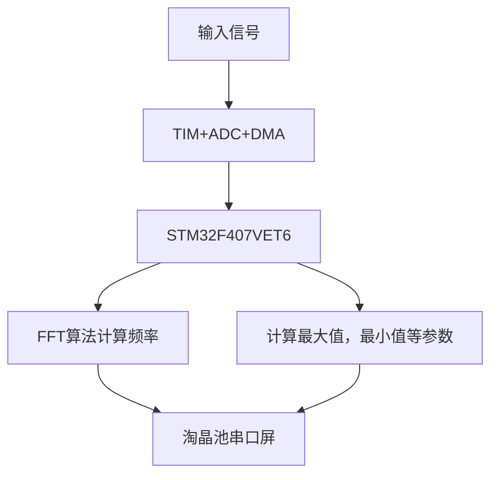

以下是可以直接在 Obsidian 中渲染的 Markdown 格式笔记，内容总结了向量正交分解、傅立叶级数与傅立叶变换的关系：

  

向量正交分解、傅立叶级数与傅立叶变换的联系

  

1. 线性代数中的正交向量分解

• 性质：有限且离散维度

• 描述：

在有限维向量空间中，有一组正交基向量，任意向量可以通过这些正交基的线性组合表示。

$$ \vec{v} = c_1 \vec{e}_1 + c_2 \vec{e}_2 + \dots + c_n \vec{e}_n $$

其中 为正交基， 为对应的系数。

  

2. 周期函数的傅立叶级数展开

• 性质：无限但离散维度

• 描述：

对于周期函数 ，可以将其展开为一组离散的正交基函数（三角函数或复指数函数）：

$$ f(x) = \sum_{n=-\infty}^{\infty} c_n e^{i n \omega_0 x}, \quad \omega_0 = \frac{2\pi}{T} $$

其中 是正交基， 是傅立叶系数。

• 离散性：基函数对应的频率 是离散的。

  

3. 非周期函数的傅立叶变换

• 性质：无限且连续维度

• 描述：

对于非周期函数 ，可以将其展开为连续的正交基函数（复指数函数）：

$$ f(x) = \frac{1}{2\pi} \int_{-\infty}^{\infty} F(\omega) e^{i \omega x} d\omega $$

其中 是正交基， 是傅立叶变换。

• 连续性：基函数的频率 是连续的。

  

4. 三者的联系

1. 有限离散维度：

• 线性代数中的正交向量分解。

• 空间基向量有限。

2. 无限离散维度：

• 傅立叶级数（周期函数展开）。

• 空间基函数是离散的三角函数或复指数函数，频率 离散。

3. 无限连续维度：

• 傅立叶变换（非周期函数展开）。

• 空间基函数是连续的复指数函数，频率 连续分布。

  

5. 直观总结

  

数学中向量空间的“维度”逐步推广为：

1. 有限离散维度：线性代数的正交向量分解。

2. 无限离散维度：傅立叶级数展开（周期函数）。

3. 无限连续维度：傅立叶变换（非周期函数）。

  

这种推广体现了数学的抽象与统一，将有限维向量空间的正交分解推广到函数空间的正交分解，函数空间本质上是“无穷维度”的。

  

这份笔记结构清晰，能够直接在 Obsidian 中正确渲染，公式也符合 LaTeX 规范。

当然可以！以下是直接渲染公式的 Obsidian Markdown 笔记：

  

为什么对函数作傅立叶变换能解数学物理方程？

  

1. 数学物理方程的特征

  

数学物理方程通常是线性偏微分方程，例如：

• 波动方程：

$$

\frac{\partial^2 u}{\partial t^2} - c^2 \nabla^2 u = 0

$$

• 热传导方程：

$$

\frac{\partial u}{\partial t} - \kappa \nabla^2 u = 0

$$

• 拉普拉斯方程：

$$

\nabla^2 u = 0

$$

  

这些方程的特点是包含空间和时间变量的导数项，线性性质使傅立叶变换能够有效简化它们。

  

2. 傅立叶变换的作用

  

傅立叶变换将函数从时空域转化到频域，在频域中，微分运算变成了乘法运算。

  

微分的傅立叶变换性质

  

设 的傅立叶变换为 ，则：

• 一阶导数：

$$

\mathcal{F} \left( \frac{\partial u}{\partial x} \right) = i\omega \hat{u}(\omega, t)

$$

• 二阶导数：

$$

\mathcal{F} \left( \frac{\partial^2 u}{\partial x^2} \right) = -\omega^2 \hat{u}(\omega, t)

$$

  

3. 具体步骤

  

以波动方程为例：

$$

\frac{\partial^2 u}{\partial t^2} - c^2 \frac{\partial^2 u}{\partial x^2} = 0

$$

  

1. 对方程作傅立叶变换

  

对方程关于 作傅立叶变换，得到：

$$

\mathcal{F} \left( \frac{\partial^2 u}{\partial t^2} - c^2 \frac{\partial^2 u}{\partial x^2} \right) = 0

$$

利用傅立叶变换的性质：

$$

\frac{\partial^2 \hat{u}(\omega, t)}{\partial t^2} + c^2 \omega^2 \hat{u}(\omega, t) = 0

$$

  

2. 简化为代数方程

  

这个方程是关于 的二阶常微分方程，其解为：

$$

\hat{u}(\omega, t) = A(\omega) \cos(c\omega t) + B(\omega) \sin(c\omega t)

$$

其中 和 由初始条件确定。

  

3. 反变换回时空域

  

通过傅立叶逆变换，将解 转回时空域：

$$

u(x, t) = \mathcal{F}^{-1} \left[ \hat{u}(\omega, t) \right]

$$

  

4. 为什么傅立叶变换有效？

1. 微分变乘法：将微分方程转化为代数方程，简化求解。

2. 线性方程的性质：傅立叶变换与线性运算相容。

3. 处理初始条件和边界条件：在频域中更易结合条件求解。

4. 非周期问题的推广：傅立叶变换是傅立叶级数的推广，适用于非周期问题。

  

5. 总结

  

傅立叶变换将函数从时空域转到频域，把复杂的偏微分方程简化为易解的代数方程，再通过傅立叶逆变换返回原域，从而得到解。

  

这种方法的核心思想是：

将复杂问题转化为简单问题，再还原到原问题的解。

当然可以！以下是直接渲染公式的 Obsidian Markdown 笔记：

  

为什么对函数作傅立叶变换能解数学物理方程？

  

1. 数学物理方程的特征

  

数学物理方程通常是线性偏微分方程，例如：

• 波动方程：

$$

\frac{\partial^2 u}{\partial t^2} - c^2 \nabla^2 u = 0

$$

• 热传导方程：

$$

\frac{\partial u}{\partial t} - \kappa \nabla^2 u = 0

$$

• 拉普拉斯方程：

$$

\nabla^2 u = 0

$$

  

这些方程的特点是包含空间和时间变量的导数项，线性性质使傅立叶变换能够有效简化它们。

  

2. 傅立叶变换的作用

  

傅立叶变换将函数从时空域转化到频域，在频域中，微分运算变成了乘法运算。

  

微分的傅立叶变换性质

  

设 的傅立叶变换为 ，则：

• 一阶导数：

$$

\mathcal{F} \left( \frac{\partial u}{\partial x} \right) = i\omega \hat{u}(\omega, t)

$$

• 二阶导数：

$$

\mathcal{F} \left( \frac{\partial^2 u}{\partial x^2} \right) = -\omega^2 \hat{u}(\omega, t)

$$

  

3. 具体步骤

  

以波动方程为例：

$$

\frac{\partial^2 u}{\partial t^2} - c^2 \frac{\partial^2 u}{\partial x^2} = 0

$$

  

1. 对方程作傅立叶变换

  

对方程关于$x$作傅立叶变换，得到：

$$

\mathcal{F} \left( \frac{\partial^2 u}{\partial t^2} - c^2 \frac{\partial^2 u}{\partial x^2} \right) = 0

$$

利用傅立叶变换的性质：

$$

\frac{\partial^2 \hat{u}(\omega, t)}{\partial t^2} + c^2 \omega^2 \hat{u}(\omega, t) = 0

$$

  

2. 简化为代数方程

  

这个方程是关于$t$的二阶常微分方程，其解为：

$$

\hat{u}(\omega, t) = A(\omega) \cos(c\omega t) + B(\omega) \sin(c\omega t)

$$

其中$A(\omega)$和$B(\omega)$和 由初始条件确定。

  

3. 反变换回时空域

  

通过傅立叶逆变换，将解 转回时空域：

$$

u(x, t) = \mathcal{F}^{-1} \left[ \hat{u}(\omega, t) \right]

$$

  

4. 为什么傅立叶变换有效？

1. 微分变乘法：将微分方程转化为代数方程，简化求解。

2. 线性方程的性质：傅立叶变换与线性运算相容。

3. 处理初始条件和边界条件：在频域中更易结合条件求解。

4. 非周期问题的推广：傅立叶变换是傅立叶级数的推广，适用于非周期问题。

  

5. 总结

  

傅立叶变换将函数从时空域转到频域，把复杂的偏微分方程简化为易解的代数方程，再通过傅立叶逆变换返回原域，从而得到解。

  

这种方法的核心思想是：

将复杂问题转化为简单问题，再还原到原问题的解。

以下是整理好的 拉普拉斯变换在数学物理方程中的应用 的 Markdown 笔记，可以直接在 Obsidian 中渲染：

  

拉普拉斯变换在数学物理方程中的应用

  

1. 拉普拉斯变换的定义

  

对函数 ，其拉普拉斯变换定义为：

$$

F(s) = \mathcal{L}[f(t)] = \int_0^{\infty} f(t) e^{-st} dt, \quad s \in \mathbb{C}

$$

其中$s$是复变变量，且$t>=0$ 。

  

2. 拉普拉斯变换的性质

  

微分运算性质

  

拉普拉斯变换可以将微分方程中的 微分运算 化为 代数运算：

• 一阶导数：

$$

\mathcal{L} \left[ \frac{df(t)}{dt} \right] = sF(s) - f(0)

$$

• 二阶导数：

$$

\mathcal{L} \left[ \frac{d^2f(t)}{dt^2} \right] = s^2 F(s) - sf(0) - f’(0)

$$

  

3. 拉普拉斯变换解偏微分方程的步骤

  

示例：一维热传导方程

  

$$

\frac{\partial u}{\partial t} - \kappa \frac{\partial^2 u}{\partial x^2} = 0, \quad u(x, 0) = f(x)

$$

  

步骤一：对时间变量作拉普拉斯变换

  

对方程关于 作拉普拉斯变换，设 ，则时间导数变换为：

$$

\mathcal{L}\left[ \frac{\partial u}{\partial t} \right] = sU(x, s) - u(x, 0) = sU(x, s) - f(x)

$$

方程变为：

$$

sU(x, s) - f(x) - \kappa \frac{\partial^2 U(x, s)}{\partial x^2} = 0

$$

  

步骤二：化简为常微分方程

  

重新整理方程，得到：

$$

\frac{\partial^2 U(x, s)}{\partial x^2} - \frac{s}{\kappa} U(x, s) = -\frac{f(x)}{\kappa}

$$

这是关于 的二阶常微分方程。

  

步骤三：求解代数方程

  

解出 ，其中 的解形式取决于初始条件和边界条件。

  

步骤四：拉普拉斯逆变换

  

通过拉普拉斯逆变换，将 转回时空域，得到原方程的解 。

  

4. 拉普拉斯变换与傅立叶变换的对比

  

性质 傅立叶变换 拉普拉斯变换

定义域

主要应用 空间域和频率域，解决无界域问题 时间域，解决初值问题

变换核

微分运算 变成 的乘法 变成 的乘法（带初始条件）

适用方程类型 偏微分方程、周期问题 初值问题、瞬态现象

  

5. 总结

• 傅立叶变换：适用于 无界域 和 空间变量，主要解决稳态问题。

• 拉普拉斯变换：适用于 半无界域（如时间域 ），特别适合处理具有初始条件的 瞬态问题。

  

在实际应用中，两者可以结合使用，高效求解数学物理方程。

$$ \left\{
	\begin{aligned}
	&U = \frac{1}{\omega C}I\\
	&\phi_{u} = \phi_{i}-\frac{\pi}{2}
	\end{aligned}
	\right.$$

# 复数的 \( n \) 次根解法

## 已知条件
复数 \( z \) 表示为：
$$
z = r (\cos \theta + i \sin \theta),
$$
其中：
- \( r \) 为复数的模；
- \( \theta \) 为复数的辐角。

复数的 \( n \) 次根记为 \( w \)，表示为：
$$
w = \rho (\cos \varphi + i \sin \varphi),
$$
其中：
- \( \rho \) 是模；
- \( \varphi \) 是辐角。

---

## 解法过程

### 第一步：根据模和辐角的关系
利用棣莫弗公式：
$$
\rho^n (\cos n\varphi + i \sin n\varphi) = r (\cos \theta + i \sin \theta),
$$
将复数 \( w \) 提到 \( n \) 次方后与 \( z \) 比较。

---

### 第二步：分解模和角度
比较模和角度，得到两个方程：
1. 模的关系：
   $$
   \rho^n = r.
   $$
   即：
   $$
   \rho = r^{\frac{1}{n}}.
   $$
2. 角度的关系：
   $$
   n\varphi = \theta + 2k\pi, \quad k = 0, \pm1, \pm2, \dots.
   $$

---

### 第三步：解得辐角
从角度关系式可以得到：
$$
\varphi = \frac{\theta + 2k\pi}{n}, \quad k = 0, 1, \dots, n-1.
$$

---

## 复数的 \( n \) 次根公式
综合模和角度的结果，复数的 \( n \) 个不同的次根为：
$$
w_k = r^{\frac{1}{n}} \left[ \cos \frac{\theta + 2k\pi}{n} + i \sin \frac{\theta + 2k\pi}{n} \right],
\quad k = 0, 1, \dots, n-1.
$$

其中：
- \( r^{\frac{1}{n}} \) 表示模的 \( n \) 次方根；
- \( \frac{\theta + 2k\pi}{n} \) 表示对应的辐角。

---

## 结果总结
复数的 \( n \) 次根共有 \( n \) 个，分布在复平面上，中心对称，且间隔角度为：
$$
\frac{2\pi}{n}.
$$


```Python
import matplotlib.pyplot as plt
import numpy as np

# 设置支持中文的字体
plt.rcParams['font.family'] = 'sans-serif'
plt.rcParams['font.sans-serif'] = ['SimHei']  # 使用SimHei作为无衬线字体
plt.rcParams['axes.unicode_minus'] = False  # 正常显示负号

# 示例数据
x = np.linspace(0, 10, 100)
y = np.sin(x)

# 创建图形
plt.figure(figsize=(10, 5))
plt.plot(x, y)
plt.title("正弦波示例图")
plt.xlabel("X 轴")
plt.ylabel("Y 轴")

# 显示图形
plt.show()

```
```Python

```

```python
import micropip

# 安装matplotlib（如果尚未安装）
await micropip.install("matplotlib")

import matplotlib.pyplot as plt
import numpy as np

# 生成数据
x = np.linspace(0, 10, 100)  # 从0到10生成100个点
y1 = np.sin(x)  # 正弦波
y2 = np.cos(x)  # 余弦波
y3 = np.sin(2 * x)  # 正弦波（频率加倍）
y4 = np.cos(2 * x)  # 余弦波（频率加倍）

# 创建一个2x2的子图
fig, axs = plt.subplots(2, 2, figsize=(10, 8))  # 设置图形大小为10x8

# 绘制第一个子图
axs[0, 0].plot(x, y1, color='blue')
axs[0, 0].set_title('正弦波')
axs[0, 0].set_xlabel('X 轴')
axs[0, 0].set_ylabel('Y 轴')

# 绘制第二个子图
axs[0, 1].plot(x, y2, color='orange')
axs[0, 1].set_title('余弦波')
axs[0, 1].set_xlabel('X 轴')
axs[0, 1].set_ylabel('Y 轴')

# 绘制第三个子图
axs[1, 0].plot(x, y3, color='green')
axs[1, 0].set_title('频率加倍的正弦波')
axs[1, 0].set_xlabel('X 轴')
axs[1, 0].set_ylabel('Y 轴')

# 绘制第四个子图
axs[1, 1].plot(x, y4, color='red')
axs[1, 1].set_title('频率加倍的余弦波')
axs[1, 1].set_xlabel('X 轴')
axs[1, 1].set_ylabel('Y 轴')

# 调整布局以避免重叠
plt.tight_layout()

# 显示图形
plt.show()


```

```python
import micropip

# 安装matplotlib（如果尚未安装）
await micropip.install("matplotlib")

import matplotlib.pyplot as plt
import numpy as np

# 生成数据
x = np.linspace(0, 10, 100)  # 从0到10生成100个点
y = np.sin(x)  # 计算每个点的正弦值

# 创建图形
plt.figure(figsize=(6, 3))  # 设置图形大小

# 绘制正弦波
plt.plot(x, y, label='正弦波', color='blue')  # 绘制曲线，设置标签和颜色

# 添加标题和标签
plt.title("正弦波示例图")
plt.xlabel("X 轴")
plt.ylabel("Y 轴")

# 添加网格和图例
plt.grid(True)
plt.legend()

# 显示图形
plt.show()

```

\documentclass{article}
\usepackage{amsmath} % 推荐加载以增强数学支持

\begin{document}

运动的速度表示为：$\dot{v}$

\end{document}

$$

f_{X_1, X_2 | X_3}(x_1, x_2 | x_3) = \frac{f_{X_1, X_2, X_3}(x_1, x_2, x_3)}{f_{X_3}(x_3)}, \quad f_{X_3}(x_3) > 0

$$

# 留数
## 孤立奇点
### 奇点类型
#### 可去奇点
#### 极点
#### 本性奇点
#### 函数零点与极点的关系
#### 函数在无穷远处的性态
### 判断极点的级数

## 留数
### 留数的定义
### 留数定理
### 留数的计算
1. 三个规则，三个公式
2. 定义
### 无穷远处留数的计算
1. 定义
2. 公式

# 复变函数可视化

## 复变函数的基本概念

复变函数是指自变量和因变量均为复数的函数，通常表示为 $$ w = f(z) $$，其中 $$ z = x + iy $$ 是复数，$$ w $$ 也是复数。复变函数可以分解为实部和虚部，即 $$ w = u(x, y) + iv(x, y) $$，其中 $$ u $$ 和 $$ v $$ 是实值函数。

## 可视化方法

### 1. 使用Matplotlib和NumPy

Python中的`matplotlib`和`numpy`库非常适合进行复变函数的可视化。可以通过以下步骤实现：

- **定义复变函数**：首先定义你想要可视化的复变函数。
- **创建网格**：在复平面上创建一个网格以计算函数值。
- **计算函数值**：使用定义的复变函数计算每个网格点的值。
- **绘制图形**：使用`matplotlib`绘制等高线图或颜色图，以显示函数的实部、虚部或模。

### 2. 示例代码

下面是一个简单的示例代码，展示如何可视化复变函数 $$ f(z) = z^2 $$
```python
import micropip 
await micropip.install("numpy")
await micropip.install("matplotlib")

import numpy as np
import matplotlib.pyplot as plt

# 定义复变函数
def f(z):
    return z**2

# 创建网格
x = np.linspace(-2, 2, 400)
y = np.linspace(-2, 2, 400)
X, Y = np.meshgrid(x, y)
Z = X + 1j * Y

# 计算函数值
W = f(Z)

# 绘制实部和虚部
plt.figure(figsize=(10, 5))

plt.subplot(1, 2, 1)
plt.contourf(X, Y, W.real, levels=50, cmap='RdYlBu')
plt.colorbar()
plt.title('Real Part of f(z)')
plt.xlabel('Re(z)')
plt.ylabel('Im(z)')

plt.subplot(1, 2, 2)
plt.contourf(X, Y, W.imag, levels=50, cmap='RdYlBu')
plt.colorbar()
plt.title('Imaginary Part of f(z)')
plt.xlabel('Re(z)')
plt.ylabel('Im(z)')

plt.tight_layout()
plt.show()

```


### 3. 可视化导数

除了可视化基本的复变函数外，还可以通过计算导数并可视化其变化来深入理解这些函数的性质。这可以通过类似的方法实现，利用`numpy`计算导数并使用`matplotlib`进行展示。

## 总结

使用Python进行复变函数的可视化不仅是可行的，而且能够帮助更好地理解这些复杂的数学概念。通过编写代码并观察不同参数对结果的影响，将获得更直观的学习体验。

建模手论文手数理知识扎实
建模手浙江出身，非常扎实的编程基础
论文手其实是全能手

# 电路分析笔记：通频带宽计算

## 例题：计算通频带宽 $B$

### 已知条件：
- 电路参数：
  $$
  L = 10 \, \text{mH}, \, C = 1 \, \mu\text{F}, \, R = 10 \, \Omega
  $$
- 求：谐振角频率 $\omega_0$、谐振频率 $f_0$、品质因数 $Q$ 和通频带宽 $B$。

---

### 1. 计算谐振角频率 $\omega_0$  
公式：  
$$
\omega_0 = \frac{1}{\sqrt{LC}}
$$  
代入已知值：  
$$
\omega_0 = \frac{1}{\sqrt{(10 \times 10^{-3})(1 \times 10^{-6})}} = \frac{1}{\sqrt{10^{-8}}} = 10^4 \, \text{rad/s}
$$  

---

### 2. 计算谐振频率 $f_0$  
公式：  
$$
f_0 = \frac{\omega_0}{2\pi}
$$  
代入 $\omega_0 = 10^4 \, \text{rad/s}$：  
$$
f_0 = \frac{10^4}{2\pi} \approx 1591.55 \, \text{Hz}
$$  

---

### 3. 计算品质因数 $Q$  
公式：  
$$
Q = \frac{\omega_0 L}{R}
$$  
代入 $\omega_0 = 10^4 \, \text{rad/s}$，$L = 10 \, \text{mH}$，$R = 10 \, \Omega$：  
$$
Q = \frac{10^4 \times 10 \times 10^{-3}}{10} = 10
$$  

---

### 4. 计算通频带宽 $B$

#### 方法 1：$B = \frac{\omega_0}{Q}$  
$$
B = \frac{\omega_0}{Q} = \frac{10^4}{10} = 1000 \, \text{rad/s}
$$  

将 rad/s 转换为 Hz：  
$$
B = \frac{1000}{2\pi} \approx 159.15 \, \text{Hz}
$$  

#### 方法 2：$B = f_0 \times \frac{1}{Q}$  
$$
B = f_0 \times \frac{1}{Q} = 1591.55 \times \frac{1}{10} = 159.15 \, \text{Hz}
$$  

---

### 5. 结果对比
- 使用公式 $B = \frac{\omega_0}{Q}$ 时，$B = 1000 \, \text{rad/s}$，转换为 Hz 后为 $159.15 \, \text{Hz}$。  
- 使用公式 $B = f_0 \times \frac{1}{Q}$ 时，直接得到 $159.15 \, \text{Hz}$。  

两种方法结果一致。

---

### 总结
- **单位换算关系**：  
  $$  
  \omega_0 = 2\pi f_0  
  $$  

- **通频带宽的两种计算公式**：  
  - 若使用角频率 $\omega_0$：  
    $$  
    B = \frac{\omega_0}{Q}  
    $$  
    单位为 rad/s，需除以 $2\pi$ 转换为 Hz。  

  - 若使用普通频率 $f_0$：  
    $$  
    B = f_0 \times \frac{1}{Q}  
    $$  
    单位为 Hz，直接适用。  

**注意**：两个公式本质一致，但需确保 $\omega_0$ 和 $f_0$ 的单位正确转换。

# 狄拉克函数的性质

## 定义
狄拉克函数 $\delta(x)$ 是一种广义函数，其非正式定义如下：
$$
\delta(x) = 
\begin{cases}
\infty, & x = 0, \\
0, & x \neq 0,
\end{cases}
$$
并满足归一化性质：
$$
\int_{-\infty}^{\infty} \delta(x) \, dx = 1.
$$

## 性质
### 1. 抽样性质（Sifting Property）
对于任意在 $x = 0$ 处连续的函数 $f(x)$，有：
$$
\int_{-\infty}^\infty f(x) \delta(x) \, dx = f(0).
$$
更一般地，当 $\delta(x - a)$ 移动到 $x = a$ 时：
$$
\int_{-\infty}^\infty f(x) \delta(x - a) \, dx = f(a).
$$

### 2. 奇异性
$\delta(x)$ 是一个分布，在 $x \neq 0$ 处为 $0$，在 $x = 0$ 处以某种方式“集中”。

### 3. 缩放性质
若 $a \neq 0$，则：
$$
\delta(ax) = \frac{1}{|a|} \delta(x).
$$

### 4. 对称性
$$
\delta(-x) = \delta(x).
$$

### 5. 卷积性质
任意函数 $f(x)$ 与 $\delta(x)$ 卷积时，函数保持不变：
$$
f(x) * \delta(x) = f(x).
$$

### 6. 导数性质
$\delta(x)$ 的导数 $\delta'(x)$ 在分布意义下满足：
$$
\int_{-\infty}^\infty f(x) \delta'(x) \, dx = -f'(0).
$$

## 应用
1. **信号处理：** $\delta(t)$ 用于表示瞬时冲击信号。
2. **物理学：** 描述点质量、点电荷或集中分布的物理量。
3. **数学分析：** 傅里叶变换中的单位脉冲信号，频域表示为常数：
   $$
   \mathcal{F}\{\delta(t)\} = 1.
   $$
4. **控制理论：** 单位脉冲响应分析的核心。
5. **偏微分方程：** 处理包含源项的偏微分方程。

## 注意事项
- $\delta(x)$ 是广义函数，不是通常意义上的函数。
- 在数学上的严谨定义依赖于分布理论。

```image-layout-a
![[Pasted image 20250301114131.png]]
![[Pasted image 20250301114131.png]]
```

```image-layout-a
![[2d_wave_animation.gif]]
![[ea847c00c3356bc42d6414af4b16189.png]]
```

我觉得上英语课的教师巨难受，然后学习就要舒服地学。方法是请假，要不就是英语课摸鱼。

# 采样显示草稿
以100k采样率为例，对于频率为1k的波形
+ 每个周期(1ms)就要有100个点，一个周期要100像素的width
+ 因为200us/div，所以显示一个周期要五格
+ 如果20us/div，显示一个周期要50格，采样率要变成1000k，即1M
+ 如果2us/div，显示一个周期要500格，采样率要变成10M
+ 所以一个格子width为20
+ 一个限速对应一个点，一个点对应1/100k秒。
3.3v-4095-255pixel
0.25v-310-20pixel
1v-80pixel
3,3v-264
1v-400pixel
3.3v-1320pixel


+ 硬件
	+ **可控增益放大模块**
	+ 采样调理
+ 软件
	+ **数据采集方案选择**：实时+顺序等效采样
	+ 频谱分析：使用FFT计算周期

低频模式
1k基波-5k谐波->采样率至少10k
100k基波-500k谐波->采样率至少1000k


```python
import micropip 
await micropip.install("matplotlib")
import matplotlib.pyplot as plt

# 频率数据（单位kHz）
f = [1, 2, 3, 4, 5, 6, 7, 8, 9, 10, 11.5, 12, 13, 14, 15, 16]
# 输出电压数据（单位V）
Uo = [1.00, 1.02, 1.01, 1.01, 1.00, 1.01, 1.01, 1.00, 0.94, 0.88, 0.71, 0.61, 0.57, 0.23, 0.12, 0.06]

plt.plot(f, Uo)
plt.xlabel('f (kHz)')
plt.ylabel('Uo (V)')
plt.title('amplitude-frequency characteristic curve')
plt.grid(True)
plt.show()

```

```python
import micropip 
await micropip.install("matplotlib")
await micropip.install("numpy")
await micropip.install("scipy")
import matplotlib.pyplot as plt
import numpy as np
from scipy.signal import chirp
import matplotlib.pyplot as plt

# 采样率
fs = 10000  
# 信号持续时间（秒）
t = np.linspace(0, 1, fs, endpoint=False)  
# 起始频率（Hz）
f0 = 1  
# 终止频率（Hz）
f1 = 10  

# 生成线性扫频正弦波
sweep_signal = chirp(t, f0=f0, t1=t[-1], f1=f1)

# 绘制波形
plt.plot(t, sweep_signal)
plt.xlabel('时间 (s)')
plt.ylabel('幅度')
plt.title('扫频正弦波')
plt.show()
```


# 第5章 非平衡载流子
## 载流子寿命
- 不同材料载流子寿命差异大，砷化镓寿命极短，为 $10^{-9} - 10^{-8} s$ 或更低；制造晶体管的锗材料寿命在几十微秒到二百多微秒；平面器件用的硅寿命一般在几十微秒以上。同种材料在不同条件下，寿命也会在很大范围变化。

## 5.3 准费米能级
### 热平衡状态
- 半导体电子系统处于热平衡时，整个半导体有统一费米能级 $E_F$，非简并情况下：
  - 电子浓度 $n_0 = N_c \exp(\frac{E_F - E_c}{k_0 T})$
  - 空穴浓度 $p_0 = N_v \exp(\frac{E_v - E_F}{k_0 T})$（式 5 - 8）
- 热平衡时，电子浓度和空穴浓度乘积满足式(5 - 1)，统一费米能级是热平衡标志。

### 非平衡状态
- 外界破坏热平衡，半导体处于非平衡态，不再有统一费米能级。电子系统热平衡靠热跃迁实现，能带内热跃迁频繁，短时间达平衡，但导带和价带间热跃迁稀少（隔禁带）。
- 存在非平衡载流子时，可认为价带和导带电子各自基本处于平衡态，导带和价带间不平衡。可分别引入导带和价带的局部费米能级，即准费米能级。
  - 导带准费米能级（电子准费米能级）：$E_{Fn}$
  - 价带准费米能级（空穴准费米能级）：$E_{Fp}$
- 引入准费米能级后，非平衡载流子浓度公式：
  - $n = N_c \exp(\frac{E_{Fn} - E_c}{k_0 T})$
  - $p = N_v \exp(\frac{E_v - E_{Fp}}{k_0 T})$（式 5 - 9）
  - 只要载流子浓度不高使 $E_{Fn}$ 和 $E_{Fp}$ 进入导带或价带，此式适用。

### 准费米能级与载流子浓度关系
- $n = n_0 \exp(\frac{E_{Fn} - E_F}{k_0 T})$（式 5 - 10）
- $p = p_0 \exp(\frac{E_F - E_{Fp}}{k_0 T})$
- 非平衡载流子越多，准费米能级偏离 $E_F$ 越多，但 $E_{Fn}$ 和 $E_{Fp}$ 偏离 $E_F$ 程度不同。
  - 以 n 型半导体小注入（$\Delta n \ll n_0$）为例，$n > n_0$，$E_{Fn}$ 比 $E_F$ 更靠近导带，偏离 $E_F$ 小；注入空穴 $\Delta p > p_0$，$p > p_0$，$E_{Fp}$ 比 $E_F$ 更靠近价带，且更显著偏离 $E_F$。
  - 一般非平衡态下，多数载流子准费米能级与平衡时费米能级偏离小，少数载流子准费米能级偏离大。

### 准费米能级与热平衡偏离程度
- 电子和空穴浓度乘积：$np = n_0 p_0 \exp(\frac{E_{Fn} - E_{Fp}}{k_0 T})$（式 5 - 11）
- $E_{Fn}$ 和 $E_{Fp}$ 偏离大小反映 $np$ 和 $n_0 p_0$ 相差程度，即半导体偏离热平衡程度。偏离越大，不平衡越显著；两者靠近，越接近平衡态；两者重合，形成统一费米能级，半导体处于平衡态。

```matlab
clear; clc; close all;

%% 基础参数配置
M = 8;                  % 每个符号采样点数
N_list = [1e4, 1e5, 1e6];    % 待对比符号数
alpha_list = [0.25, 0.35, 0.5]; % 待对比滚降系数
SynIdx_list = [4, 5, 6];% 新增第6点，共3个待对比采样点位置
EbN0_fixed = 9.5;       % 固定信噪比为9.5dB
snr_fixed = EbN0_fixed - 10*log10(M/2); % 转换为采样后信噪比
ber_records = zeros(length(alpha_list), 1); % 单信噪比下BER记录

%% 1. 滚降系数对BER影响仿真（固定EbN0=9.5dB）
fprintf('========== 滚降系数影响仿真（EbN0=9.5dB） ==========\n');
N_fixed = 1e5; % 固定符号数
SynIdx_fixed = 5; % 固定最佳采样点
for alpha_idx = 1:length(alpha_list)
    alpha = alpha_list(alpha_idx);
    gt = rcosdesign(alpha, 8, M, 'sqrt'); % 生成对应滚降系数的滤波器
    
    err = 0; cnt = 0; target_err = 1000; % 统计足够错误比特
    while err < target_err && cnt < 20 % 限制最大迭代次数
        % 数据生成与传输链路
        u = randi([0,1], 1, N_fixed);
        I = u*2 - 1;
        In = upsample(I, M);
        sb = conv(In, gt);
        rb = awgn(sb, snr_fixed, 'measured'); % 加噪
        rm = conv(rb, gt); % 匹配滤波
        
        % 同步与判决
        re = reshape(rm(60+(1:N_fixed*M)), M, N_fixed);
        Ir = re(SynIdx_fixed, :);
        ur = Ir >= 0;
        
        err = err + sum(u ~= ur);
        cnt = cnt + 1;
    end
    
    ber_records(alpha_idx) = err/(N_fixed*cnt);
    fprintf('滚降系数=%.2f, BER=%.4g\n', alpha, ber_records(alpha_idx));
end

%% 2. 采样点位置验证仿真（固定EbN0=9.5dB，新增第6点）
fprintf('\n========== 采样点位置验证（EbN0=9.5dB） ==========\n');
alpha_fixed = 0.25;
gt = rcosdesign(alpha_fixed, 8, M, 'sqrt');
ber_sync = zeros(1, length(SynIdx_list));

for idx = 1:length(SynIdx_list)
    SynIdx = SynIdx_list(idx);
    err = 0; cnt = 0; target_err = 2000;
    
    while err < target_err
        u = randi([0,1], 1, 1e5);
        I = u*2 - 1;
        In = upsample(I, M);
        sb = conv(In, gt);
        rb = awgn(sb, snr_fixed, 'measured');
        rm = conv(rb, gt);
        re = reshape(rm(60+(1:1e5*M)), M, 1e5);
        Ir = re(SynIdx, :);
        ur = Ir >= 0;
        
        err = err + sum(u ~= ur);
        cnt = cnt + 1;
    end
    
    ber_sync(idx) = err/(1e5*cnt);
    fprintf('采样点位置=第%d点, BER=%.4g\n', SynIdx, ber_sync(idx));
end

%% 3. 符号数对统计性能影响仿真（固定EbN0=9.5dB）
fprintf('\n========== 符号数统计性能影响（EbN0=9.5dB） ==========\n');
ber_N = zeros(1, length(N_list));
gt = rcosdesign(0.25, 8, M, 'sqrt');

for idx = 1:length(N_list)
    N = N_list(idx);
    err = 0; cnt = 1; % 单次运行，用符号数体现统计性
    
    u = randi([0,1], 1, N);
    I = u*2 - 1;
    In = upsample(I, M);
    sb = conv(In, gt);
    rb = awgn(sb, snr_fixed, 'measured');
    rm = conv(rb, gt);
    re = reshape(rm(60+(1:N*M)), M, N);
    Ir = re(5, :);
    ur = Ir >= 0;
    
    ber_N(idx) = sum(u ~= ur)/N;
    fprintf('符号数=%.0e, BER=%.4g\n', N, ber_N(idx));
end

%% 4. 波形与曲线绘制
% 图1：原始链路关键波形（N=20，滚降系数0.25）
N = 20;
u = randi([0 1],1,N);
I = u*2-1;
In = upsample(I,8);
gt = rcosdesign(0.25,8,8,"sqrt");
sb = conv(In,gt);

figure(1);
subplot(2,2,1);
stem(1:N, I, 'filled', 'MarkerSize', 4);
title('双极性符号序列 I 波形');
xlabel('符号序号'); ylabel('幅度'); grid on;

subplot(2,2,2);
stem(0:length(In)-1, In, 'filled', 'MarkerSize', 2);
title('升采样后 In 波形');
xlabel('采样点序号'); ylabel('幅度'); grid on;

subplot(2,2,3);
stem(0:length(gt)-1,gt,'filled','MarkerSize', 3);
title('根升余弦滤波器冲激响应 gt');
xlabel('系数序号'); ylabel('幅度'); grid on;

subplot(2,2,4);
stem(0:length(sb)-1, sb, 'filled' ,'MarkerSize', 2);
title('成形滤波后 sb 波形');
xlabel('采样点序号'); ylabel('幅度'); grid on;

% 图2：滚降系数对BER影响（单值对比）
figure(2);
plot(alpha_list, ber_records, '-o','LineWidth',1.5);
title('不同滚降系数的 BER（EbN0=9.5dB）');
xlabel('滚降系数'); ylabel('误比特率 (BER)');
grid on;

% 图3：采样点位置与符号数对比（采样点新增第6点）
subplot(1,2,1);
plot(SynIdx_list, ber_sync, '-o','LineWidth',1.5);
title('不同采样点位置的 BER（EbN0=9.5dB）');
xlabel('采样点序号（每符号8点）'); ylabel('BER');
grid on;

subplot(1,2,2);
semilogx(N_list, ber_N, '-o','LineWidth',1.5); % 符号数范围大，建议用对数坐标
title('不同符号数的 BER（EbN0=9.5dB）');
xlabel('符号数'); ylabel('BER');
grid on;

%% 5. 输出关键结果
fprintf('\n========== 浮点仿真总结（EbN0=9.5dB） ==========\n');
[min_ber_sync, min_idx] = min(ber_sync);
fprintf('最佳采样点位置：第%d点（BER=%.4g）\n', SynIdx_list(min_idx), min_ber_sync);
fprintf('符号数1e6 vs 1e4 的BER差异：%.4g\n', abs(ber_N(1)-ber_N(2)));
[min_ber_alpha, min_alpha_idx] = min(ber_records);
fprintf('最优滚降系数：%.2f（BER=%.4g）\n', alpha_list(min_alpha_idx), min_ber_alpha);
```


```verilog
// 成型滤波器与匹配滤波器模块（基于33阶对称结构，滚降因子0.25，8符号，每符号8采样点）
module shaping_matching_filter (
    input wire clk,                  // 时钟信号
    input wire rst_n,                // 低电平复位信号
    input wire ena,                  // 模块使能信号
    input wire signed [8:0] din,     // 9位有符号输入数据
    output reg signed [31:0] dout,   // 滤波结果输出（宽位宽避免溢出）
    output reg ena_out               // 输出使能信号
);

// -------------------------- 1. 滤波器系数定义（共17个，利用对称性） --------------------------
// 注：系数值需根据实际MATLAB生成的rcosdesign结果替换，此处为示例占位
parameter signed COEF0  = 9'd0;    // 对应sum[0]的系数（reg_data[0]与reg_data[32]之和的系数）
parameter signed COEF1  = 9'd0;    // 对应sum[1]的系数（reg_data[1]与reg_data[31]之和的系数）
parameter signed COEF2  = 9'd0;    // 对应sum[2]的系数（reg_data[2]与reg_data[30]之和的系数）
parameter signed COEF3  = 9'd0;    // 对应sum[3]的系数（reg_data[3]与reg_data[29]之和的系数）
parameter signed COEF4  = 9'd0;    // 对应sum[4]的系数（reg_data[4]与reg_data[28]之和的系数）
parameter signed COEF5  = 9'd0;    // 对应sum[5]的系数（reg_data[5]与reg_data[27]之和的系数）
parameter signed COEF6  = 9'd0;    // 对应sum[6]的系数（reg_data[6]与reg_data[26]之和的系数）
parameter signed COEF7  = 9'd0;    // 对应sum[7]的系数（reg_data[7]与reg_data[25]之和的系数）
parameter signed COEF8  = 9'd0;    // 对应sum[8]的系数（reg_data[8]与reg_data[24]之和的系数）
parameter signed COEF9  = 9'd0;    // 对应sum[9]的系数（reg_data[9]与reg_data[23]之和的系数）
parameter signed COEF10 = 9'd0;    // 对应sum[10]的系数（reg_data[10]与reg_data[22]之和的系数）
parameter signed COEF11 = 9'd0;    // 对应sum[11]的系数（reg_data[11]与reg_data[21]之和的系数）
parameter signed COEF12 = 9'd0;    // 对应sum[12]的系数（reg_data[12]与reg_data[20]之和的系数）
parameter signed COEF13 = 9'd0;    // 对应sum[13]的系数（reg_data[13]与reg_data[19]之和的系数）
parameter signed COEF14 = 9'd0;    // 对应sum[14]的系数（reg_data[14]与reg_data[18]之和的系数）
parameter signed COEF15 = 9'd0;    // 对应sum[15]的系数（reg_data[15]与reg_data[17]之和的系数）
parameter signed COEF16 = 9'd0;    // 对应sum[16]的系数（reg_data[16]单独项的系数）

// -------------------------- 2. 内部寄存器定义 --------------------------
reg signed [8:0] reg_data [32:0];  // 33级移位寄存器（存储输入数据延迟）
reg signed [18:0] mult [16:0];     // 乘法结果寄存器（9bit数据*9bit系数=18bit）
reg signed [19:0] dout_t1, dout_t2, dout_t3, dout_t4;  // 第一级加法寄存器（18bit+18bit=19bit）
reg signed [19:0] dout_t5, dout_t6, dout_t7, dout_t8;
reg signed [21:0] sum_t1, sum_t2, sum_t3;  // 第二级加法寄存器（19bit*3=21bit）
reg signed [22:0] dout_t;                  // 第三级加法寄存器（21bit*3=22bit）
reg [2:0] ena_delay;                       // 输出使能延迟寄存器（匹配滤波时延）

// -------------------------- 3. 移位寄存器逻辑（数据延迟与缓存） --------------------------
always @(posedge clk or negedge rst_n) begin
    if (!rst_n) begin
        // 复位时清空所有移位寄存器
        integer i;
        for (i = 0; i <= 32; i = i + 1) begin
            reg_data[i] <= 9'sb0;
        end
    end else if (ena) begin
        // 使能时，数据从din移入，各级寄存器依次传递
        reg_data[0]  <= din;
        reg_data[1]  <= reg_data[0];
        reg_data[2]  <= reg_data[1];
        reg_data[3]  <= reg_data[2];
        reg_data[4]  <= reg_data[3];
        reg_data[5]  <= reg_data[4];
        reg_data[6]  <= reg_data[5];
        reg_data[7]  <= reg_data[6];
        reg_data[8]  <= reg_data[7];
        reg_data[9]  <= reg_data[8];
        reg_data[10] <= reg_data[9];
        reg_data[11] <= reg_data[10];
        reg_data[12] <= reg_data[11];
        reg_data[13] <= reg_data[12];
        reg_data[14] <= reg_data[13];
        reg_data[15] <= reg_data[14];
        reg_data[16] <= reg_data[15];
        reg_data[17] <= reg_data[16];
        reg_data[18] <= reg_data[17];
        reg_data[19] <= reg_data[18];
        reg_data[20] <= reg_data[19];
        reg_data[21] <= reg_data[20];
        reg_data[22] <= reg_data[21];
        reg_data[23] <= reg_data[22];
        reg_data[24] <= reg_data[23];
        reg_data[25] <= reg_data[24];
        reg_data[26] <= reg_data[25];
        reg_data[27] <= reg_data[26];
        reg_data[28] <= reg_data[27];
        reg_data[29] <= reg_data[28];
        reg_data[30] <= reg_data[29];
        reg_data[31] <= reg_data[30];
        reg_data[32] <= reg_data[31];
    end
end

// -------------------------- 4. 对称数据求和（利用系数对称性减少计算量） --------------------------
wire signed [9:0] sum [16:0];  // 求和结果（9bit+9bit=10bit）
assign sum[0]  = reg_data[0]  + reg_data[32];
assign sum[1]  = reg_data[1]  + reg_data[31];
assign sum[2]  = reg_data[2]  + reg_data[30];
assign sum[3]  = reg_data[3]  + reg_data[29];
assign sum[4]  = reg_data[4]  + reg_data[28];
assign sum[5]  = reg_data[5]  + reg_data[27];
assign sum[6]  = reg_data[6]  + reg_data[26];
assign sum[7]  = reg_data[7]  + reg_data[25];
assign sum[8]  = reg_data[8]  + reg_data[24];
assign sum[9]  = reg_data[9]  + reg_data[23];
assign sum[10] = reg_data[10] + reg_data[22];
assign sum[11] = reg_data[11] + reg_data[21];
assign sum[12] = reg_data[12] + reg_data[20];
assign sum[13] = reg_data[13] + reg_data[19];
assign sum[14] = reg_data[14] + reg_data[18];
assign sum[15] = reg_data[15] + reg_data[17];
assign sum[16] = reg_data[16];  // 中间项无对称，直接取数

// -------------------------- 5. 乘加运算（求和结果×系数，再累加） --------------------------
always @(posedge clk or negedge rst_n) begin
    if (!rst_n) begin
        // 复位时清空乘法和加法寄存器
        integer j;
        for (j = 0; j <= 16; j = j + 1) begin
            mult[j] <= 18'sb0;
        end
        dout_t1 <= 19'sb0;
        dout_t2 <= 19'sb0;
        dout_t3 <= 19'sb0;
        dout_t4 <= 19'sb0;
        dout_t5 <= 19'sb0;
        dout_t6 <= 19'sb0;
        dout_t7 <= 19'sb0;
        dout_t8 <= 19'sb0;
        sum_t1  <= 21'sb0;
        sum_t2  <= 21'sb0;
        sum_t3  <= 21'sb0;
        dout_t  <= 22'sb0;
    end else if (ena) begin
        // 第一步：求和结果与对应系数相乘
        mult[0]  <= COEF0  * sum[0];
        mult[1]  <= COEF1  * sum[1];
        mult[2]  <= COEF2  * sum[2];
        mult[3]  <= COEF3  * sum[3];
        mult[4]  <= COEF4  * sum[4];
        mult[5]  <= COEF5  * sum[5];
        mult[6]  <= COEF6  * sum[6];
        mult[7]  <= COEF7  * sum[7];
        mult[8]  <= COEF8  * sum[8];
        mult[9]  <= COEF9  * sum[9];
        mult[10] <= COEF10 * sum[10];
        mult[11] <= COEF11 * sum[11];
        mult[12] <= COEF12 * sum[12];
        mult[13] <= COEF13 * sum[13];
        mult[14] <= COEF14 * sum[14];
        mult[15] <= COEF15 * sum[15];
        mult[16] <= COEF16 * sum[16];

        // 第二步：乘法结果分组加法（减少进位链长度）
        dout_t1 <= mult[0]  + mult[1];
        dout_t2 <= mult[2]  + mult[3];
        dout_t3 <= mult[4]  + mult[5];
        dout_t4 <= mult[6]  + mult[7];
        dout_t5 <= mult[8]  + mult[9];
        dout_t6 <= mult[10] + mult[11];
        dout_t7 <= mult[12] + mult[13];
        dout_t8 <= mult[14] + mult[15] + mult[16];  // 最后一组含3个乘法结果

        // 第三步：二级加法
        sum_t1 <= dout_t1 + dout_t2 + dout_t3;
        sum_t2 <= dout_t4 + dout_t5 + dout_t6;
        sum_t3 <= dout_t7 + dout_t8;

        // 第四步：最终求和（得到滤波结果）
        dout_t <= sum_t1 + sum_t2 + sum_t3;
    end
end

// -------------------------- 6. 输出使能逻辑（匹配滤波时延） --------------------------
always @(posedge clk or negedge rst_n) begin
    if (!rst_n) begin
        ena_delay <= 3'b000;
        ena_out   <= 1'b0;
        dout      <= 32'sb0;
    end else begin
        // 使能信号延迟5个时钟周期（匹配乘加运算时延，可根据实际调整）
        ena_delay[0] <= ena;
        ena_delay[1] <= ena_delay[0];
        ena_delay[2] <= ena_delay[1];
        ena_out      <= ena_delay[2];

        // 时延匹配后，输出最终滤波结果（扩展为32bit方便后续处理）
        if (ena_out) begin
            dout <= {{10{dout_t[22]}}, dout_t};  // 符号扩展：22bit→32bit
        end else begin
            dout <= 32'sb0;
        end
    end
end

endmodule
```


你说的其实就是经典的反馈振荡器的平衡条件（也就是巴克豪森条件，Barkhausen Criterion），它通常分成两个部分：幅度条件和相位条件。你提到的“两个公式”正对应这两条。

  

  

  

  

一、总的反馈模型

  

  

先明确结构：

  

一个反馈振荡器可以抽象为：

  

- 放大器：$A(j\omega)$
- 反馈网络：$\beta(j\omega)$

  

  

整体开环传递函数：

  

$$

L(j\omega) = A(j\omega),\beta(j\omega)

$$

  

其中：

  

- $j\omega$：复频域变量（$j=\sqrt{-1}$，$\omega$是角频率）
- $A(j\omega)$：前向放大器的频率响应
- $\beta(j\omega)$：反馈网络的传递函数
- $L(j\omega)$：环路增益（loop gain）

  

  

  

  

  

二、振荡的两个平衡条件（核心）

  

  

  

1️⃣ 相位平衡条件（你说的“条件”）

  

  

$$

\angle A(j\omega_0)\beta(j\omega_0) = 2\pi n \quad (n=0,1,2,\dots)

$$

  

  

含义：

  

  

在振荡频率 $\omega_0$ 处：

  

👉 总相移必须是 $360^\circ$（或其整数倍）

  

  

  

  

各符号解释：

  

  

- $\angle$：表示“取相位”
- $A(j\omega_0)$：放大器在振荡频率 $\omega_0$ 下的响应
- $\beta(j\omega_0)$：反馈网络在该频率的响应
- $\omega_0$：振荡频率（未知，需要由该条件确定）
- $n$：整数，表示相位可以多圈

  

  

  

  

  

直观理解：

  

  

信号绕一圈回来之后：

  

👉 必须“同相”叠加（正反馈）

  

否则就不会持续振荡。

  

  

  

  

2️⃣ 幅度平衡条件（你说的“下位平衡条件”）

  

  

$$

|A(j\omega_0)\beta(j\omega_0)| = 1

$$

  

  

  

  

含义：

  

  

👉 环路增益的幅值必须等于 1

  

  

  

  

各符号解释：

  

  

- $|\cdot|$：表示“取模（幅值）”
- $A(j\omega_0)$：放大器增益（复数）
- $\beta(j\omega_0)$：反馈系数
- $|A\beta|$：一圈之后信号的放大倍数

  

  

  

  

  

直观理解：

  

  

- 如果 $|A\beta| > 1$：  
    👉 振幅越来越大（发散）
- 如果 $|A\beta| < 1$：  
    👉 振荡衰减消失
- 只有：  
    $$  
    |A\beta| = 1  
    $$  
    👉 振荡幅度稳定（平衡）

  

  

  

  

  

三、为什么叫“平衡条件”

  

  

因为这是一个动态平衡：

|   |   |
|---|---|
|条件|作用|
|相位条件|保证信号能“自激”|
|幅度条件|保证振幅“不爆不灭”|

  

  

  

  

四、一个更工程化写法（常见形式）

  

  

有时会写成：

  

$$

A(j\omega_0)\beta(j\omega_0) = 1

$$

  

这其实是把两个条件合并了：

  

- 幅度：$|A\beta|=1$
- 相位：$\angle A\beta = 0$

  

  

  

  

  

五、补充：启动条件（考试/设计常考）

  

  

实际电路中：

  

👉 启动时必须满足：

  

$$

|A\beta| > 1

$$

  

👉 然后通过非线性（如晶体管饱和）自动回落到：

  

$$

|A\beta| = 1

$$

  

  

  

  

六、总结（你可以这样记）

  

  

振荡器成立的核心就是两句话：

  

“相位绕一圈不变，幅度绕一圈不变。”

  

对应：

  

$$

\begin{cases}

\angle A(j\omega_0)\beta(j\omega_0) = 2\pi n \

|A(j\omega_0)\beta(j\omega_0)| = 1

\end{cases}

$$

  

  

  

如果你愿意，我可以帮你把这个条件具体应用到 RC 正弦振荡器 / 文氏桥振荡器 / LC 振荡器里推一遍（这在考试和设计里特别关键）。


这是一个典型的离子注入参数反推问题，本质是用高斯分布模型去匹配峰值浓度和结深。

  

  

  

  

一、基本模型

  

  

离子注入后浓度分布近似为高斯分布：

  

$$

N(x) = \frac{Q}{\sqrt{2\pi}\Delta R_p} \exp\left[-\frac{(x-R_p)^2}{2\Delta R_p^2}\right]

$$

其中：

  

- $Q$：注入剂量（cm⁻²）
- $R_p$：投影射程（均值）
- $\Delta R_p$：投影标准偏差（straggle）

  

  

峰值浓度出现在 $x = R_p$：

  

$$

N_{max} = \frac{Q}{\sqrt{2\pi}\Delta R_p}

$$

  

  

  

  

二、已知条件

  

  

- 衬底掺杂（n型）：  
    $$  
    N_B = 1.5 \times 10^{16} , \text{cm}^{-3}  
    $$
- 峰值浓度：  
    $$  
    N_{max} = 2 \times 10^{19} , \text{cm}^{-3}  
    $$
- 结深：  
    $$  
    x_j = 0.4 ,\mu m  
    $$

  

  

  

  

  

三、关键思路

  

  

  

1️⃣ 结深条件

  

  

结深定义为：

  

$$

N(x_j) = N_B

$$

  

代入高斯分布：

  

$$

\frac{N(x_j)}{N_{max}} = \exp\left[-\frac{(x_j - R_p)^2}{2\Delta R_p^2}\right]

$$

  

所以：

  

$$

\frac{N_B}{N_{max}} = \exp\left[-\frac{(x_j - R_p)^2}{2\Delta R_p^2}\right]

$$

  

取对数：

  

$$

\ln\left(\frac{N_B}{N_{max}}\right)

= -\frac{(x_j - R_p)^2}{2\Delta R_p^2}

$$

  

  

  

  

2️⃣ 代入数值

  

  

$$

\frac{1.5\times10^{16}}{2\times10^{19}} = 7.5\times10^{-4}

$$

  

$$

\ln(7.5\times10^{-4}) \approx -7.2

$$

  

所以：

  

$$

\frac{(x_j - R_p)^2}{2\Delta R_p^2} = 7.2

$$

  

$$

x_j - R_p = \sqrt{2\times7.2},\Delta R_p \approx 3.8,\Delta R_p

$$

  

  

  

  

3️⃣ 工艺经验关系

  

  

对于 B 在 Si 中：

  

经验上有：

  

$$

\Delta R_p \approx (0.3 \sim 0.4) R_p

$$

  

取：

  

$$

\Delta R_p \approx 0.35 R_p

$$

  

  

  

  

4️⃣ 求 Rp

  

  

$$

x_j = R_p + 3.8\Delta R_p

$$

  

代入：

  

$$

x_j = R_p + 3.8 \times 0.35 R_p

= R_p (1 + 1.33)

= 2.33 R_p

$$

  

$$

R_p \approx \frac{0.4}{2.33} \approx 0.17 ,\mu m

$$

  

  

  

  

四、估算注入能量

  

  

查标准射程表（B⁺ in Si）：

  

- $R_p \approx 0.17,\mu m$

  

  

对应：

  

👉 能量约：80 ~ 100 keV

  

取：

  

$$

E \approx 90 , \text{keV}

$$

  

  

  

  

五、计算剂量 Q

  

  

利用峰值公式：

  

$$

Q = N_{max} \cdot \sqrt{2\pi} \Delta R_p

$$

  

先算：

  

$$

\Delta R_p = 0.35 \times 0.17 \approx 0.06 ,\mu m = 6\times10^{-6},cm

$$

  

$$

\sqrt{2\pi} \approx 2.506

$$

  

代入：

  

$$

Q = 2\times10^{19} \times 2.506 \times 6\times10^{-6}

$$

  

$$

Q \approx 3.0 \times 10^{14} , \text{cm}^{-2}

$$

  

  

  

  

六、最终结果

  

  

注入参数估算：

  

- 注入能量：  
    $$  
    E \approx 90 , \text{keV}  
    $$
- 注入剂量：  
    $$  
    Q \approx 3 \times 10^{14} , \text{cm}^{-2}  
    $$

  

  

  

  

  

七、结论说明（考试要点）

  

  

这种题的核心套路：

  

1. 用高斯分布写出  
    $N_{max}$ 和 $N(x_j)$
2. 用结深条件求：  
    $$  
    x_j - R_p \sim (3\sim4)\Delta R_p  
    $$
3. 用经验关系：  
    $$  
    \Delta R_p \sim 0.3R_p  
    $$
4. 反推出：  
    

- $R_p$ → 查表得能量
- $Q$ → 峰值公式

6.   
    

  

  

  

  

如果你需要，我可以帮你整理一份**“离子注入题万能解题模板（考试直接套）”**，基本所有类似题都能秒解。